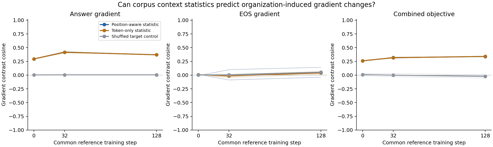

# 上下文统计与真实早期梯度：完整开发结果

固定两开发世界×两初始化；4条共同中性短轨迹，0/32/128步，72个测量臂。所有统计均为开发描述；没有拟合预测比例、选取最佳状态或做显著性检验。

每个测量臂使用完整2048篇文档×10位置轮换。方向表先平均两个组织相对中性组织的差值，再平均初始化和世界；共8个配对对比，但只有两个开发世界。



## 全部预定状态与监督部分

| 步数 | 监督部分 | 预测器 | 平均余弦 | 最小–最大 | 平均相对误差 | 平均范数比 |
| --- | --- | --- | ---: | --- | ---: | ---: |
| 0 | answer | position | 0.2948 | 0.2853–0.3143 | 1.1557 | 0.9447 |
| 0 | answer | token | 0.2943 | 0.2850–0.3141 | 1.8327 | 1.8578 |
| 0 | answer | shuffled | 0.0030 | -0.0087–0.0149 | 1.0117 | 0.1567 |
| 0 | eos | position | 0.0022 | -0.0136–0.0275 | 1.0019 | 0.0647 |
| 0 | eos | token | 0.0080 | -0.0068–0.0267 | 1.0210 | 0.2139 |
| 0 | eos | shuffled | 0.0022 | -0.0136–0.0275 | 1.0019 | 0.0647 |
| 0 | combined | position | 0.2605 | 0.2485–0.2708 | 1.1094 | 0.8068 |
| 0 | combined | token | 0.2603 | 0.2486–0.2702 | 1.6470 | 1.5942 |
| 0 | combined | shuffled | 0.0089 | -0.0192–0.0580 | 1.0082 | 0.1375 |
| 32 | answer | position | 0.4173 | 0.4010–0.4315 | 2.3234 | 2.5550 |
| 32 | answer | token | 0.4166 | 0.4003–0.4311 | 4.6996 | 5.0270 |
| 32 | answer | shuffled | 0.0046 | -0.0085–0.0196 | 1.0844 | 0.4237 |
| 32 | eos | position | 0.0053 | -0.1618–0.1426 | 1.0351 | 0.2505 |
| 32 | eos | token | -0.0163 | -0.0624–0.0394 | 1.3114 | 0.8215 |
| 32 | eos | shuffled | 0.0053 | -0.1618–0.1426 | 1.0351 | 0.2505 |
| 32 | combined | position | 0.3179 | 0.2959–0.3397 | 2.6719 | 2.8151 |
| 32 | combined | token | 0.3172 | 0.2953–0.3391 | 5.3247 | 5.5563 |
| 32 | combined | shuffled | -0.0010 | -0.0368–0.0569 | 1.1100 | 0.4812 |
| 128 | answer | position | 0.3706 | 0.3373–0.3977 | 2.6423 | 2.8411 |
| 128 | answer | token | 0.3697 | 0.3373–0.3970 | 5.2860 | 5.5719 |
| 128 | answer | shuffled | 0.0048 | -0.0076–0.0156 | 1.1049 | 0.4714 |
| 128 | eos | position | 0.0521 | -0.1245–0.1760 | 1.2885 | 0.8605 |
| 128 | eos | token | 0.0389 | 0.0050–0.0896 | 2.9347 | 2.7934 |
| 128 | eos | shuffled | 0.0521 | -0.1245–0.1760 | 1.2885 | 0.8605 |
| 128 | combined | position | 0.3395 | 0.3097–0.3656 | 2.7691 | 2.9408 |
| 128 | combined | token | 0.3404 | 0.3121–0.3658 | 5.5045 | 5.7624 |
| 128 | combined | shuffled | -0.0221 | -0.0654–0.0316 | 1.1344 | 0.5091 |

相对误差为‖真实差值−预测差值‖/‖真实差值‖；范数比为‖预测差值‖/‖真实差值‖。没有用真实梯度估计最佳缩放。EOS目标恒定，shuffled在该部分与position相同，因此EOS的两者相等不算负对照失败，也不算关联预测证据。

## 主终点的全部配对块

| 世界 | 初始化 | 组织差值 | position余弦 | token余弦 | shuffled余弦 |
| --- | --- | --- | ---: | ---: | ---: |
| 0 | 0 | company−neither | 0.2869 | 0.2869 | 0.0005 |
| 0 | 0 | project−neither | 0.2853 | 0.2850 | 0.0149 |
| 0 | 1 | company−neither | 0.3109 | 0.3108 | -0.0087 |
| 0 | 1 | project−neither | 0.3143 | 0.3141 | 0.0118 |
| 1 | 0 | company−neither | 0.2934 | 0.2925 | -0.0025 |
| 1 | 0 | project−neither | 0.2930 | 0.2928 | 0.0076 |
| 1 | 1 | company−neither | 0.2870 | 0.2861 | -0.0086 |
| 1 | 1 | project−neither | 0.2872 | 0.2866 | 0.0095 |

## 数据与数值控制

72/72臂完成，原始梯度与源码哈希复核通过。阻断跨事实注意力后，主投影梯度的最大相对消减残差为4.33e-08，低于运行前固定的1e-4阈值；不解释这些数值残差的余弦。

监督bigram计数在三组织间相同；城市×人物上下文统计在开放时不同，阻断后相同。这是对共同曝光和掩码的审计，不是表示或行为机制证明。

## 各模块的真实梯度差异

下表为开放注意力、答案部分、两个组织相对中性组织的差值；报告模块内范数，不能把不同参数块的欧氏范数解释为因果重要性。

| 步数 | 模块 | 平均差值范数 | 相对两臂平均范数 |
| --- | --- | ---: | ---: |
| 0 | token | 0.00982645 | 0.0200425 |
| 0 | position | 0.00140173 | 0.00940816 |
| 0 | blocks.0.attention.query | 0.000257498 | 0.0478393 |
| 0 | blocks.0.attention.key | 0.000263943 | 0.0501012 |
| 0 | blocks.0.attention.value | 0.00489436 | 0.0281848 |
| 0 | blocks.0.attention | 0.019808 | 0.0260856 |
| 0 | blocks.0.mlp | 0.0199909 | 0.0191931 |
| 0 | blocks.3.mlp | 0.0117847 | 0.0181113 |
| 0 | blocks.7.mlp | 0.00851532 | 0.0175424 |
| 32 | token | 0.00343339 | 0.00669271 |
| 32 | position | 0.000325903 | 0.0047403 |
| 32 | blocks.0.attention.query | 0.000102151 | 0.0339991 |
| 32 | blocks.0.attention.key | 0.000105125 | 0.0346381 |
| 32 | blocks.0.attention.value | 0.00181802 | 0.0235353 |
| 32 | blocks.0.attention | 0.00728407 | 0.0209926 |
| 32 | blocks.0.mlp | 0.00682808 | 0.0128873 |
| 32 | blocks.3.mlp | 0.00305384 | 0.00796859 |
| 32 | blocks.7.mlp | 0.00178565 | 0.00527191 |
| 128 | token | 0.00337177 | 0.00686375 |
| 128 | position | 0.000356374 | 0.00375431 |
| 128 | blocks.0.attention.query | 0.00011088 | 0.0251463 |
| 128 | blocks.0.attention.key | 0.00011178 | 0.0252903 |
| 128 | blocks.0.attention.value | 0.00173464 | 0.0276434 |
| 128 | blocks.0.attention | 0.00662339 | 0.0247392 |
| 128 | blocks.0.mlp | 0.00589619 | 0.0180513 |
| 128 | blocks.3.mlp | 0.00254916 | 0.0223958 |
| 128 | blocks.7.mlp | 0.00161888 | 0.0190356 |

attention无后缀的行只包含输出投影及其bias；Q/K/V分别列出。token是绑定的输入embedding/输出head，不能只解释为输出层。所有其他层、EOS、combined及company−project均保存在完整JSON/CSV中，不只保留上述示例行。

## 复现

```bash
PYTHONPATH=src python scripts/run_bios_context_gradient.py summarize
PYTHONPATH=src python scripts/report_bios_context_gradient.py
```

运行前定义与全部固定指标见[快照](preregistration.md)和[锁](preregistration-lock.json)。原始产物位于results/bios-context-gradient-v1，包含12个共同参数/优化器状态、72臂的答案/EOS全模型梯度和三个预测器的主投影矩阵。首次GPU0加载触发ECC错误，无梯度产出；随后使用GPU6完成，设计及预算不变。
