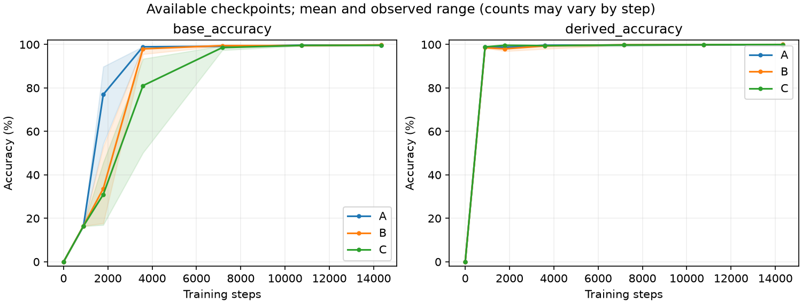

# A/B/C 文档组织实验：完成结果与方法

日期：2026-09-26。**已完成 12 个旧模型、96 个编辑案例、12 份终点诊断。**

**本轮观察到：数据组织改变学习过程；编辑效果则明显依赖编辑方法，没有统一最优组织。** 人物聚合 B 相比打散 C，在四个配对块中都更早观测到学习达标。A 的早期学习优势没有变成更低的平均 99% 达标成本，且其全参数编辑传播明显较弱。

这是两个世界上的符号开发结果，不是确认性结论。所有结果采用冻结预算和预定终点；[执行契约](experimental-protocol.md)与[配置](../configs/bios-organization-development-v1.json)保持不变。

## 学习结果

各条件为同样的四个世界／初始化块。首次达标要求基础与组合查询同时≥99%，仅在预定检查点观测；不代表精确达标时刻。

| 条件 | 1,792 步基础准确率 | 首次达标平均步数 | 14,336 步基础准确率 | 终点组合准确率 |
| --- | ---: | ---: | ---: | ---: |
| A | 76.97% | 6,272 | 99.72% | 99.91% |
| B | 33.67% | 6,272 | 99.82% | 100.00% |
| C | 30.96% | 9,856 | 99.64% | 99.96% |

按世界/初始化 0/0、0/1、1/0、1/1 排列，首次达标步数分别为 A=[3584,7168,7168,7168]，B=[7168,7168,7168,3584]，C=[10752,10752,10752,7168]。A/B 的平均和中位数相同；B/C 四组均相差一个 3584 步观测间隔。1,792 步是展示早期曲线的预定节点，不用它替代完整学习轨迹。

12 个条件配对中 11 个通过预定旧知识匹配门槛。唯一未通过的是世界1／初始化1的 A/C，基础准确率差 0.501943 个百分点，略超 0.5 门槛；两模型组合准确率均为100%。这对仍保留在固定预算总体结果中；质量匹配子集只作条件性描述。

## 固定 512 步编辑结果

所有 96 个案例的直接修改 E 均为100%。下表为必要传播 D，括号为满足直接修改、传播及预留保持测试池门槛的联合通过数。每格先在模型内平均两个支持集，再对四模型等权平均；8次编辑不是8个独立模型。

| 组织 | MLP／一致 | MLP／例外 | 全参数／一致 | 全参数／例外 |
| --- | ---: | ---: | ---: | ---: |
| A | 100.00%（6/8） | 58.07%（0/8） | 84.24%（0/8） | 36.98%（0/8） |
| B | 99.61%（7/8） | 52.73%（0/8） | 97.01%（5/8） | 48.44%（0/8） |
| C | 99.09%（4/8） | 48.83%（0/8） | 96.61%（5/8） | 50.39%（0/8） |

A 在 MLP 例外更新中的 D 均值较高，但在全参数编辑中更低；因此不能从一种编辑器推出组织的普遍可编辑性排序。B/C 四类编辑的配对方向也均非四块一致。全部48个例外编辑都未联合通过，直接事实写入与必要传播仍有明显差距。

例外更新中，新实际城市不同于公司默认的人员最难正确传播：MLP 的 D 为 A 23.33%、B 16.11%、C 16.39%，全参数为 3.89%、4.44%、6.67%。大量错误回答了个人实际城市；这些是输出行为诊断，不单独证明模型内部采用何种算法。

联合通过只约束预定 U_heldout 测试池。完整 U_full 的旧正确事实损伤、共同旧正确保持集上的配对差值和中途曾通过情况均保留在[完整汇总](development-artifacts/organization-v1/report.md)及其相邻CSV/JSON中。曾通过不替代512步终点。

## 表征诊断与审计

12份终点测量共3840个探针，均保存完整答案生成。以零起算layer=1（第二层）作为探索性截面，公司均值 donor 干预使目标完整答案转向 donor 的增量为 A +7.92、B +21.25、C +55.63 个百分点；同范数随机方向三组均为0。对应出生城市旧正确事实损伤为0.20%、6.46%、30.77%，无关公司损伤为1.57%、1.46%、5.42%。每模型先汇总8个recipient，再对四模型等权平均；不将探针当独立重复。

C 的较大目标响应伴随较大非目标损伤，不能据此称其公司表征更纯或更共享；不同模型的公司均值位移范数也未跨条件固定。全部层和五种干预的结果保留在组织诊断表中，这个截面不是确认性机制检验。

84个学习检查点、1056个编辑检查点全部通过保存预测复核；逐事实曝光、位置曝光、学习率加权曝光、实际初始／终点状态哈希及跨条件配置一致性均通过。最终执行器只验证并复用36个已完成阶段，没有补跑或覆盖结果。工程检查85项测试通过，静态与格式检查通过。

最后一段排程只暂停旧调度父进程以避免重复领取任务，GPU子任务继续运行；带锁调度器补齐后恢复父进程并正常退出。冻结训练预算和模型过程未改变。父进程账本中的阶段结束时间含调度等待，成本比较使用模型内部记录与步数/FLOPs。

- [完成与源码校验清单](../configs/bios-organization-completion-20260926.json)
- [完整结果、质量匹配和保持分层](development-artifacts/organization-v1/report.md)
- [数据审计](development-artifacts/organization-v1/data-audit.json)
- 原始权重、预测和日志：`results/bios-organization-dev-v1/`；可审查的小型产物副本：`docs/development-artifacts/organization-v1/`。

## 研究问题与数据组织

研究同一批知识被分组到不同训练文档后，模型的闭卷学习表现和后续知识更新是否改变。沿用 bioS-Work 的两个受控世界：2048 人、64 家公司，每家公司 32 人、2 个旧例外；共有 12,352 条基础事实和 2048 条人员到雇主默认工作城市的组合查询。

每篇文档包含七条完整真实事实：雇主、公司默认城市、个人实际城市、出生日期、出生城市、大学、专业。组织操作只改变完整事实的共同呈现，不改变事实内部的主体、关系或答案。

| 条件 | 六条人物事实 | 公司默认事实 |
| --- | --- | --- |
| A：关系链组织 | 来自同一个人 | 来自该人的真实雇主 |
| B：人物组织 | 来自同一个人 | 来自一家无关公司 |
| C：打散组织 | 来自六个不同人员，且公司来源不同 | 与六个人的公司来源均不同 |

B/C 保留完全相同的“个人实际城市事实—公司默认事实”配对，因此两者答案偶然相同的比例精确一致；不以强制异城制造反关联。无关公司使用多组独立排列，避免每家雇主总与同一家无关公司绑定。

A−B 比较在同人文档中加入正确公司关联的总体效果；B−C 比较同人事实聚合的总体效果；A−C 给出完整组织操作的比较。身份重复、上下文线索和属性共现都是操作的一部分，不能预先将某组命名为“高共享”或据此认定内部机制。

这是**文档分组实验**：七条事实位于一个允许因果注意力的上下文中。历史 SA/AS 则将独立事实按“结构先学／个人事实先学”分阶段训练。本轮三组共同混合训练，不与 SA/AS 顺序交叉；历史预算和默认事实重复率也不同，跨批次数值不能当作受控因果比较。

## 控制与学习预算

| 控制项目 | 当前执行方式 |
| --- | --- |
| 真值与呈现 | 三组使用相同事实呈现多重集、符号记录和答案频数；每次呈现有可追踪 ID |
| 每轮曝光 | 2048 篇文档 × 7 条事实，共 14,336 次；每条个人事实一次，每条公司默认事实 32 次 |
| 位置与顺序 | 共同文档置换及关系槽位循环轮换；每完整七轮让所有呈现遍历七个位置 |
| 文档边界 | 每篇文档独占一个 batch 样本，注意力不跨文档；文档内部可读取前面的事实 |
| 输入与监督 | 每条记录为 6 token，每篇为 42 token；只监督七个值及其 EOS，共 14 个位置 |
| 每步数据 | 16 篇文档，即 112 条基础事实，另加 28 条孤立旧世界组合 QA；损失权重 0.8/0.2 |
| 模型与起点 | 从头训练的 8 层 GPT-2 式 Transformer，宽度 768、12 头、MLP 宽度 3072；同世界、同初始化的 A/B/C 起始权重相同 |
| 优化与终点 | AdamW，学习率 1e-4、weight decay 0.1、梯度裁剪 1；前 16 轮预热，每轮学习率固定；共 112 轮、14,336 步 |

保存逐事实、逐位置和学习率加权曝光，并核对三条件在共同节点的一致性。预定学习检查点为 0、896、1792、3584、7168、10752、14336 步，均在完整七轮边界；不根据观察到的效果延长、早停或选择最佳检查点。

本批完成矩阵为 **2 个世界 × 2 个初始化 × 3 个组织条件 = 12 个模型**，对应四个世界／初始化配对块。组织随机种子固定为 0；每个终点另做一次全层公司均值干预及完整生成诊断，共完成 12 份测量。

## 学习评价

主要评价不给支持文档，以孤立查询自由生成完整答案：先生成值，再基于实际生成值生成 EOS，两者均正确才计为答对。报告基础事实、组合查询准确率、值位置 NLL、未终止率，以及雇主、公司默认、非例外实际城市、旧例外实际城市和独立属性的分层表现。

分别报告固定预算能学会多少，以及在预定节点首次同时达到基础／组合准确率各 ≥99% 的观测成本；未达标运行保留并注明预算删失。达到学习标准不会改变训练终点或编辑起点。主要成本比较使用步数、曝光、监督 token 和执行形状下的 FLOPs 估算；共享 GPU 的训练秒数只描述实际运行时间，受资源竞争影响。

所有 2048 条旧世界组合查询均通过共同的孤立 QA 流进入学习。因此，这里测量**已学组合查询的掌握和更新传播**，不是从未见过的组合泛化。

## 配对编辑与保持指标

每个模型使用两个预定支持集，各选择三家公司。每例修改 93 条基础事实：3 条公司默认城市及原来跟随默认的 90 人实际城市。比较两类更新：

- **一致更新：**公司默认城市变化，原来的 30 名非例外成员全部跟随新默认。
- **例外更新：**公司默认变化与一致臂相同；每家公司 15 人跟随新默认，15 人转到另一城市。

旧有六个人的实际城市保持不变。两种更新控制修改位置、条数及新答案频数，不声称目标的信息量或可压缩性相同；同一对目标在 A/B/C 上重复。

每个有效终点运行 **2 个支持集 × 2 种更新 × 2 种编辑方法 = 8 个案例**，全批次完成 96 个。FT-MLP 修改零起算第 3–5 层的完整 MLP，FT-All 修改全部参数。两者均采用新事实 CE 加旧知识回放 KL，学习率 3e-5、KL 权重 1，固定 512 步；目标是预定、未按新答案 NLL 筛选的配对。本轮不增加 FT-Down、分支或第二层窗口。

| 指标 | 定义与用途 |
| --- | --- |
| E：直接修改 | 93 条受监督基础事实的新答案准确率，另列公司默认根事实和人员实际城市 |
| D：必要传播 | 三家公司全部 96 人的雇主默认城市查询，包含旧例外；其新答案不进入编辑监督或回放 |
| `U_heldout` 破坏率 | 仅在未供编辑器使用的保持测试集内，对编辑前答对的查询计算编辑后答错比例；主要保持判据 |
| `U_full` 破坏率 | 在全部应保持查询中，对编辑前答对的查询计算编辑后答错比例；包含可回放及保留测试事实，作为更广的保持描述 |
| `U_accuracy` | 全部应保持查询的当前准确率，包含原先答错者；不能替代旧正确知识破坏率 |

`U_heldout` 的“未见”仅指未提供给编辑器；这些知识可以在旧世界学习中出现。基础保持事实按 ID 划分可回放池与保留测试池，同一事实不跨两侧；未变的组合查询全部留作评价。D 与保持测试事实不进入编辑回放。

保持按四个互斥分层报告：被编辑公司的旧例外实际城市、这些公司人员的雇主与独立属性、未编辑公司的默认／实际城市与组合查询、未编辑公司人员的雇主与独立属性。第三层另拆基础事实与组合查询。每个分层注明旧正确分母；空分母记不可评价，不记零损伤。较小分层错一条即可超过 1%，必须同时报告条数。

主要报告固定 512 步终点的 E、D、各层保持损伤，并保存 0、1、2、4、8、16、32、64、128、256、512 步完整曲线。联合达标要求公司默认事实全对，人员更新和 D 各 ≥95%，`U_heldout` 各必要分层破坏率均 ≤1%；不以中途最佳点替代终点。首次观测达标成本仅作曲线摘要。

## 解释边界

- **重复单位：**只有两个独立生成的世界；四个世界／初始化配对块和 12 个模型不等于 12 个独立世界。先在同模型内汇总支持集，再跨配对块比较，不能把 96 个编辑、事实、预算检查点或多个干预 probe 当作独立模型重复。本批次是开发证据，不报告确认性显著性。
- **旧知识质量：**保留全部有效终点的编辑结果，另报告预定旧知识相近的两两子集。按旧准确率或 NLL 筛选属于处理后条件化，不能把子集当成总体效应，也不能把未充分学会知识误判为编辑机制差异。
- **上下文与位置：**孤立评价移除了训练中常见的前文支持。每条事实会轮到文档首位，但位置平衡不等于任意相对句序均匀；当前轮换和监督规则是共同的实验包装。结果可能同时包含参数记忆、上下文依赖和提取路径的影响。
- **机制证据：**公司均值干预和激活统计是候选机制测量；组织标签或准确率差异本身不证明“共享表示导致编辑困难”。固定层窗口、学习率和有限预算也限制可推广范围。
- **自然语言范围：**英文文档仅由共同呈现映射渲染，供阅读与核查；尚未进行自然语言模型训练、人工模板语义认证或别名泛化评价。Qwen、SmolLM2、RippleEdits 和更大确认矩阵属于后续计划。
