# 研究结果汇总

本文件新增完整标准Transformer/Loop的24条开发、30条新世界确认和2条事后诊断，其它历史结果保持；研究问题与后续设计见[前沿问题定义](hebbian-learning-plan-v1.md#frontier-question-20261001)。新增完整Qwen3-0.6B-Base的三臂共同复习及六分支更新开发；首轮两组开发保留；此前固定调用后的新知识组合比较含4个开发/校准读取器和12个新世界正式运行。历史批次分数保持原记录。源码、原始契约与审计见[冻结产物目录](development-artifacts/)。测试和审计计数分别属于对应批次。

## 当前证据

**研究定位补充。** MLP承担重要事实记忆作用的既有文献依据，以及简化架构中已经完成的机制验证，均继续保留。新增0.6B级完整预训练LM开发观察，再做同系列或架构适用性复核；不同证据层级衔接，不将尚待推广解释为前一验证无效。0.6B已完成[共同复习与更新开发](#small-lm-composition-v2)，三臂单跳均100%，直接两跳6.25%/4.69%/15.63%；正式确认尚未启动。历史分数、源码和冻结契约保持。

简化架构的模块替换比较中，普通交叉熵与加入统一输出表示约束的模型，原知识两跳均接近满分；固定调用过程并更换事实MLP后，新知识单跳均100%，两跳为66.39%/94.66%。六个配对均改善，支持这一训练方案在受控模块架构中提升知识复用，是后续检验的依据；两臂的记忆与在其上学到的调用Q/K同时不同，全部收益尚不能只归于记忆输出几何。不直接解释自然模型或此前端到端文本模型的失败。

此前组合结构比较在逐事实使用次数与token边际完全匹配时，令熟悉事实的新链从15.11%提高至66.30%；独立目标人物与桥实体上的严格组合仅1.57%→2.16%，单跳与自主两次调用均100%。它建立搭配支持的局部泛化收益，仍未建立可靠的严格目标调用；小幅效应及完整世界差异均保留。

此前损失来源实验中，同一端点继续训练4096步，保留原子与背景组合损失时目标组合为84.59%，只保留原子损失时为43.10%，两者单跳均100%。四臂显示强交互；后一分支换入中性分支的MLP后恢复到70.96%，单跳保持100%，注意力也有部分贡献。两批训练与评价定义不同，不合并为自然大模型的统一定律。

**2026-10-01按用户纠正后的解释与待办。** 当前选题是参数知识存储与多跳计算原理，见[根本问题与S0–S3](hebbian-learning-plan-v1.md#frontier-question-20261001)；上一版知识更新×推理预算矩阵撤回。记忆替换支持低负载构造下的组合复用，尚非容量标度；Loop轮数扫描没有同时操纵事实负载，长循环的单跳也退化，尚不能分离存储与组合边界。正常Transformer/Loop的负载比较已完成，见[本批结果](#standard-storage-composition)。使用角色、首尾共现及更新保持的旧限制继续保留；全部历史成绩、冻结判据与完成清单不变。

1. 单跳正确与外部两次调用成功，不能保证一次前向的组合泛化。两层小Transformer留出组合96.44%，一层及参数量接近的宽一层约25%–28%；收益在接近相同计算预算下仍在。后续仅替换第一块的首跳关系位置，89.31%的答案正确跟随新路径，头实体位置对照仅0.13%，支持可供后续组合使用的首跳信息；仍不证明每层严格做一跳。
2. 固定表示、指定功能与未见知识的保持要求不同。真实模型存在跨位置响应，保护末位置特征不足以保证最终输出保持。
3. 数据组织和训练相关性会影响学习与传播，但“更容易学会”没有成为“更容易编辑”的通用规律。内部机制的选择性证据仍有限。
4. 完整答案、额外推理计算、格式/别名及精度会改变结论的强弱；必须与主指标分开记录。
5. 历史低负载单跳任务中，固定读取器后交换事实MLP，CE与完整向量MSE均成功。新增[两跳替换比较](#memory-reuse)已完成；它使用CE与CE加向量约束，不是历史CE/MSE单跳成绩的重复。

<a id="standard-storage-composition"></a>
## 标准Transformer/Loop：事实负载与两跳组合

**24条开发、30条正式比较与2条事后诊断完成，56个终点重载通过。** 标准1/2/3层与共享1层循环2/3次均保留正常GPT-2的可学习词/位置Embedding、完整Q/K/V与输出投影、因果注意力、pre-LayerNorm、两条残差、4倍GELU MLP及绑定读出。宽256、4头、MLP1024，全部参数训练；与Hugging Face GPT-2前向数值一致。Loop与标准1初始权重相同，不加入指定功能模块。40项相关检查及ruff通过；工程一致性不代替科学证据。

原4000步10条开发暴露测试事实复习次数混淆，结果与源码保留。改用测试子图外的anchor事实后，另做10条8000步开发及4条16000步预算检查，再冻结三个新世界720001/720002/720003、共同初始化721001、五架构×两负载共30条。每条固定16000步，主端点不择中途最佳。事实为受控随机关系，使用模板语言完整下一词元CE；这是完整标准架构的受控训练，不直接作为自然预训练LM机制结论。见[原始设计](development-artifacts/storage-composition-v1/design.md)、[修订与预算决定](development-artifacts/storage-composition-v1/amendment-20261001.md)和[冻结配置](../configs/storage-composition-v1-confirmation.json)。

**负载与必要事实曝光分开控制。** 词表1685及各架构参数固定；共同768条原子与组合流逐条相同，额外槽位在低负载重复256条不参与测试链的anchor，在高负载学习5376条新增原子，总独立事实1024/6144。每批三流各64例，总预算、输入形状及监督token相同；主测试链的必要原子总曝光严格匹配，新增事实的逐条曝光不同。正式训练共706,560,000个监督token。首尾实体对全局留出，不能借另一条同首尾路径见到结果。

下表是**背景子图留出两跳完整生成准确率，三个世界等权均值**。该池允许事实参加组合练习；实际两条边均有组合经历的覆盖为90.87%/92.25%/94.49%，不称全池每条边都已有组合角色。单独严格池的两条边均从未参加组合训练。逐世界、完整分母及角色覆盖保留，不把查询当独立世界。

| 架构 | 独立参数 | 1024条事实 | 6144条事实 |
| --- | ---: | ---: | ---: |
| 标准1层 | 1,225,728 | 32.66% | 22.10% |
| 标准2层 | 2,015,488 | 33.07%† | 47.69% |
| 标准3层 | 2,805,248 | 53.26% | 39.25% |
| 1层Loop×2 | 1,225,728 | 40.66% | 32.27% |
| 1层Loop×3 | 1,225,728 | 43.33% | 37.00% |

†标准2层低负载的逐世界成绩为49.60%/49.22%/0.37%。第三世界训练组合在8000步100%、16000步退化至35.51%，答案与完整分数一致，不是EOS失分；必要原子、自主调用仍100%。该格保留于正式均值，不能把其差异解释为存储或组合容量边界。另有标准3层在第二世界高负载略高1.16个百分点，因此也不宣称普遍随负载下降。逐世界图见下方。

**前提与有限结论。** 正式端点的共同原子99.87%–100%，主池两必要原子全对覆盖及自主两次调用99.61%–100%，高负载新增原子99.98%–100%；除上述退化端点，其余29条训练组合100%。在等参数比较中，Loop能改善背景子图新组合，单跳掌握不能自动保证直接两跳。严格无组合角色池仅0%–1.76%；这个有限训练协议未建立稳定的跨事实组合。固定预算增加事实负载后三个世界的标准1层及两种Loop均下降，标准3层方向不一致；独立参数量、有效深度和优化状态共同影响结果，尚非信息论容量规律或唯一MLP归因。

**同一权重的循环诊断。** R2训练的Loop在低/高负载下，R1→R2的主池均值25.96%→40.66%/19.06%→32.27%，共同原子均接近100%，支持这一区间的额外计算贡献。R8时共同原子降至2.60%/0.65%，不能将长循环失败解释为纯组合瓶颈。R3训练模型在R4有小幅/反向变化，没有一般“多算必好”规律。全部R=1/2/3/4/6/8见[循环图](development-artifacts/storage-composition-v1/confirmation/repeat-sweep.png)，不择最佳R替代主分数。

**事后训练退化诊断已完成。** 第三世界标准2层低/高负载父端点分别再训4096步，保留AdamW动量、数据流及随机状态，只降lr至0.0001。低负载训练/留出仍35.51%/0.37%；高负载训练100%、留出52.57%→53.31%。该小步长续训未恢复操作，不证明不可恢复或架构上限。两端点生成、NLL与继续曝光重载通过；首次曝光审计把续训当新epoch，修正到两个部分epoch的正确计数界后通过，未放宽预测容差。见[诊断契约](development-artifacts/storage-composition-v1/recovery-design.md)与[完整诊断](development-artifacts/storage-composition-v1/recovery/summary.json)。不替换确认成绩。

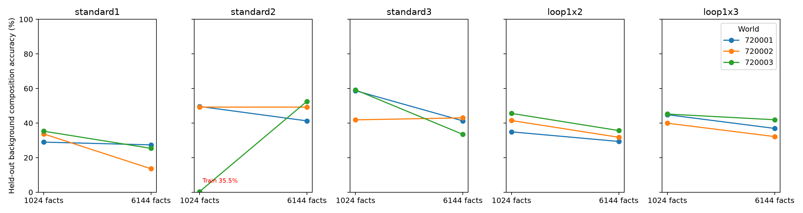

[30格逐项表](development-artifacts/storage-composition-v1/confirmation/endpoints.csv)、[世界统计](development-artifacts/storage-composition-v1/confirmation/aggregate.json)、[正式学习与循环汇总](development-artifacts/storage-composition-v1/confirmation/summary.json)、[54条开发/确认完成清单](development-artifacts/storage-composition-v1/completion-manifest.json)及[2条诊断完成清单](development-artifacts/storage-composition-v1/recovery/completion-manifest.json)包含源码、配置、数据、权重、曝光与审计哈希。权重和全部节点预测位于`results/storage-composition-v1/`。

复现主矩阵：`.venv/bin/python scripts/run_storage_composition.py execute --config configs/storage-composition-v1-confirmation.json --workers 2`；已完成运行会跳过。独立核验示例：同入口`audit --config configs/storage-composition-v1-confirmation.json --name w720001-loop1x2-low`。汇总用`.venv/bin/python scripts/report_storage_composition.py`；精确重训须使用冻结源码与环境，不覆盖已有结果。

<a id="small-lm-composition-v2"></a>
## 完整Qwen：共同复习、关联呈现和事实更新的快速开发

**三条512步训练、六条256步更新/复习及九端点重载均完成。** 本轮是一个既有开发世界150001、一个训练种子的快速比较；没有启动三个新世界确认、1.7B或0.8B。保留原始Qwen3-0.6B-Base架构和全部596,049,920可训练参数，从原始预训练权重分别训练；主张是行为效应与更新传播，不定位唯一MLP机制。方法借鉴、运行前固定的比较和预算见[开发契约](development-artifacts/small-lm-composition-v2/development-plan.md)。

**独立单跳校准已有效，关联呈现保留小幅两跳收益。** 复用v1的64目标链、16背景链及逐步事实抽样；每批8组原子各增加一份独立复习，背景组合仍2条。三臂主呈现分别为独立文档、同批第二条事实随机无关联拼接、同链按顺序拼接。无关联配对每批重抽，并排除同链和相同最终城市；每条原子事实保持真值。主两跳答案未训练，每臂361,291输入token、343,883监督token，逐批原子及监督token多重集精确相同。拼接改变位置、padding和attention工作量；无关联/关联的padded token为579,930/586,430，分开为406,504，不声称等FLOPs或唯一语义干预。

| 固定512步；完整64目标链 | 分开＋复习 | 无关联拼接＋复习 | 关联拼接＋复习 |
| --- | ---: | ---: | ---: |
| 两条单跳，各自准确率 | 100%/100% | 100%/100% | 100%/100% |
| 目标直接两跳，主问法 | 6.25%（4/64） | 4.69%（3/64） | 15.63%（10/64） |
| 目标直接两跳，一个留出问法 | 10.94% | 4.69% | 15.63% |
| 两种问法的单跳与自主两次调用 | 均100% | 均100% | 均100% |
| 已训练背景两跳及背景单跳 | 100% | 100% | 100% |

关联相对分开/无关联为+9.38/+10.94个百分点；这是单世界开发观察，不能称跨世界确认或显著效应。三臂共同两单跳正确覆盖100%，条件分数与全池相同；256步三臂也已两单跳100%。它解决了v1关联组第二单跳仅21.88%的混淆，但关联文档仍让首实体与城市共同出现，不能直接证明严格未共现组合或通用调用。v1→v2同时增加复习、改变损失配比，因此不把跨版本的28.13%→15.63%解释成单一机制效应。

**更新目标有效，但没有建立稳定的组合更新。** 在读取训练结果前，每个城市选2条，共32条更新链；另32条保持链U不回放。新城市是无固定点双射，保持答案分布。每个父端点都派生update/replay，重置相同AdamW与随机种子：每步8条第二跳新/原事实、共同回放4条该组首跳、4条背景原子和2条背景组合，记录之间独立。目标两跳及其新答案未作为组合监督。两分支各256步、95,528输入/90,920监督token，逐批长度与计算形状相同。普通全参数更新并非严格保持编辑。

下表E/D覆盖全部32条预定更新链；update和replay的“新两跳”均按相同更新后真值评分。U两原子列依次为首跳/次跳。

| 父模型呈现 | 更新后E单跳 | 更新后D新两跳 | 复习对照D新两跳 | 更新后D仍答旧城市 | update的U两原子 | replay的U两原子 |
| --- | ---: | ---: | ---: | ---: | --- | --- |
| 分开 | 100.00% | 6.25% | 9.38% | 3.13% | 62.50%/28.13% | 65.63%/84.38% |
| 无关联拼接 | 100.00% | 9.38% | 12.50% | 3.13% | 81.25%/21.88% | 56.25%/71.88% |
| 关联拼接 | 100.00% | 18.75% | 12.50% | 12.50% | 62.50%/50.00% | 65.63%/87.50% |

所有update分支的E首跳、新次跳和E自主两次调用，在主问法及留出问法均100%；所有replay分支的E原事实保持100%，按新次跳真值为0%。六分支背景单跳与已训练组合均100%。新两跳效果应与replay比较，而不是只看更新组绝对分数。 三种呈现的主问法差值依次为−3.13/−3.13/+6.25个百分点，关联组为6/32对4/32；其留出问法两臂均4/32，未建立稳定方向。完整留出问法、U两跳、自主调用和全部节点保留于逐格表。

未回放事实的提取下降也发生于原事实复习分支，提示有限回放和继续训练改变了保持；新事实更新进一步损害部分次跳保持。不能把D低分全归于唯一组合接口或把表中低分称为知识被从参数中擦除。原本E池直接两跳仅0/32、2/32、3/32，因此这也不是“多数原先成功的组合在更新后失效”的检验。逐题转移和格式复核属于事后描述，见[补充审计](development-artifacts/small-lm-composition-v2/secondary-analysis.json)；不使用这些子集替代完整32条结果。

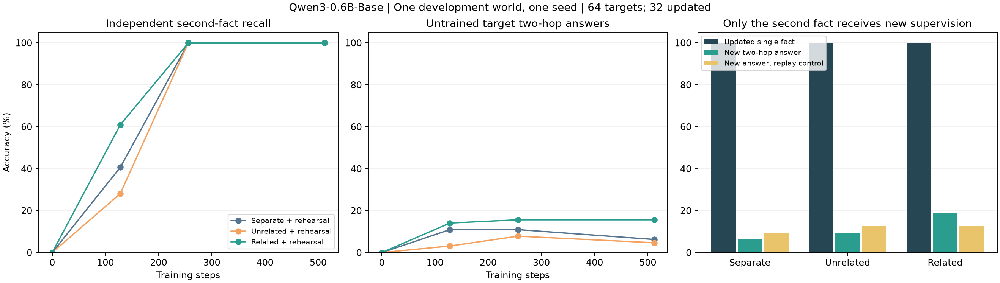

**复核与资源。** 7项相关契约测试、四个新增Python文件静态/格式检查通过。9端点共5,040项生成重载逐token一致；11,520项节点预测独立复算，1,152项自主调用核对真实生成桥，9模型全部张量形状及12项架构设置与原模型一致。三臂初始输出一致，更新/复习分支同父初始输出一致；完整源码、数据、检查点哈希保留。总计3,072次更新、1,657,041输入token、1,577,169监督token，估算训练矩阵FLOPs 7.9653e+15，训练段累计307.21秒，运行内部计时和1572.02秒；后者含加载、评价、保存与重载，但不含进程启动、前置哈希核验、开发实现及末次独立汇总。共享磁盘在后期分支的启动、读取和重载时变慢，计算耗时与全流程耗时分开。

[汇总](development-artifacts/small-lm-composition-v2/summary.json)、[逐格分数](development-artifacts/small-lm-composition-v2/endpoint-cells.csv)、[独立审计](development-artifacts/small-lm-composition-v2/independent-audit.json)、[完成清单](development-artifacts/small-lm-composition-v2/completion-manifest.json)、[配置](../configs/small-lm-composition-development-v2.json)及[执行入口](../scripts/run_small_lm_followup.py)均保留。下一步优先以新世界复核呈现效应；更新支线先校准保持和原组合前提，再谈内部定位，暂不扩大模型规模。

<a id="small-lm-composition"></a>
## 完整Qwen3-0.6B中的事实学习与组合：首轮开发

**首轮两组开发及全部终点重载已完成；当时发现的关联组单跳前提问题，已在[v2](#small-lm-composition-v2)中校准。** 直接从原始Qwen3-0.6B-Base权重开始，保留28层正常因果Transformer、原始分词器与已学习Embedding、残差、注意力、归一化及独立MLP；全部596,049,920参数共同训练。数据为自然语言表达的虚构导师/居住城市事实，不使用自定义实体向量。模型与训练定义见[冻结设计](development-artifacts/small-lm-composition-v1/development-plan.md)。

一个开发世界、64目标三元组与16背景三元组，分别按原子问答独立文档或原顺序连接文档训练。背景组合监督两臂相同；目标两跳问答不进入训练。各512步，模型初值及抽样相同，每臂192,222个输入token、183,006个监督token，原子曝光精确匹配。文档分组改变位置与attention计算量，不声称等FLOPs。评价为闭卷贪心生成、不提供事实/桥实体、不限制候选词表，保存完整输出，主分数为规范化首行完整答案。

| 固定512步端点 | 分开呈现 | 关联呈现 |
| --- | ---: | ---: |
| 目标第一条单跳，64题 | 100.00% | 100.00% |
| 目标第二条单跳，64题 | 100.00% | 21.88% |
| 目标未训练两跳，64题 | 6.25% | 28.13% |
| 已训练背景两跳，16题 | 100.00% | 100.00% |

分开呈现已经在真实预训练模型中建立“能分别提取两条事实、能答背景组合、目标新组合仍差”的开发现象。关联呈现的第二条单跳独立提取尚未学稳，不能把两跳差值直接解释为知识掌握相近时的组合能力收益，更不能定位为唯一MLP机制。共同两单跳正确仅覆盖14/64=21.88%，该子集两跳为14.29%/28.57%；这是处理后子集，不能替代完整目标池。联合文档还可能建立头实体到城市的直接关联，不能据此称严格隐式组合验证。

完整0/128/256/512节点保留；分开组256步已两单跳100%、目标两跳6.25%，关联组256步第二单跳18.75%、目标两跳31.25%，仍按预定512步报告。只有一个世界、一个训练种子，不作正式确认或显著性声明。本批据此提出共同独立原子复习，后续已由[v2](#small-lm-composition-v2)完成校准及主比较；本批不删案例或追选高分节点。

3项契约测试及三个新增Python文件静态检查通过。416项终点生成重载逐token一致、416项独立重计分通过；初始208项生成两臂一致。两模型各310个张量与原模型键/形状一致，12项架构配置保持；全部参数进入优化器且首步均有有限梯度，Embedding、首末层注意力/MLP及归一化的样本参数均变化。两臂共1024更新、384,444输入token，训练段累计101.12秒、含加载/评价/保存的进程时间275.34秒；峰值显存约11.03GB，GPU2顺序运行。0.8B/1.7B未启动新训练。

[汇总](development-artifacts/small-lm-composition-v1/summary.json)、[开发判断](development-artifacts/small-lm-composition-v1/development-assessment.json)、[原架构与独立评分核验](development-artifacts/small-lm-composition-v1/independent-checks.json)、[源码与模型锁](development-artifacts/small-lm-composition-v1/lock.json)、[两臂完整产物](../results/small-lm-composition-v1/)和[运行入口](../scripts/run_small_lm_composition.py)均保留。

<a id="memory-reuse"></a>
## 固定调用过程后，新知识能否直接组合

**开发校准及三个新世界的12项正式比较已全部完成，作为简化架构中的机制验证保留。** 主要问题只有一个：在知识A上训练好调用过程后，换入只靠原子事实训练的新知识B，能否直接回答B的两跳？[初版开发](development-artifacts/memory-reuse-v1/development-plan.md)、[前提校准](development-artifacts/memory-reuse-v1/calibration-plan.md)及[正式契约](development-artifacts/memory-reuse-v1/confirmation-plan.md)分别保留运行前定义。

沿用《MLPs are Hebbians》[A.4.3的固定读取器/换事实方法](https://arxiv.org/html/2607.10034v1#A4.SS3)，直接复用锁定作者实现的SwiGLU和注意力块。每世界128实体、固定单位词向量、一个随机关系f，任务为f(f(h))。A/B共享词表，B重新随机排列且每条原子映射都改变；B是条件随机替换，不是新实体词表。两层单头共享一个事实MLP，无残差、无位置编码、V/O固定单位阵，只有两层Q/K接受调用训练。第一块读出单跳、第二块读出两跳；层间连续传递，不作argmax回送，也不提供真值中间实体。

每臂先用单跳拟合A的事实MLP并冻结，再学习A的单跳与全部两跳。随后冻结调用过程，独立用B的单跳拟合新MLP，并同时替换两层的共享记忆。B组合答案不参与优化、早停或节点选择。普通臂为交叉熵；统一表示臂增加`10 × mean(||MLP(e) − e_target||²)`，目标来自同一冻结词嵌入。中性与查询token使用恒等映射作为两臂共同的结构支撑，也计入该MLP目标。

**三个世界149011/149012/149013，每世界两个初始化，固定4000步调用训练端点。** 先平均世界内初始化，再对世界等权。每端点128实体×8个独立中性上下文，完整词表的单实体token准确率如下；A是已训练组合的新上下文，B是没有组合监督的新事实映射。

| 检验 | 普通交叉熵 | 加入统一表示约束 |
| --- | ---: | ---: |
| 原知识A的单跳 | 100.00% | 100.00% |
| 原知识A的两跳 | 99.46% | 99.97% |
| 换入B后，新知识的单跳 | **100.00%** | **100.00%** |
| 换入B后，新知识的两跳 | **66.39%** | **94.66%** |
| 保留错误A记忆，按B两跳答案计分 | 0.52% | 0.52% |

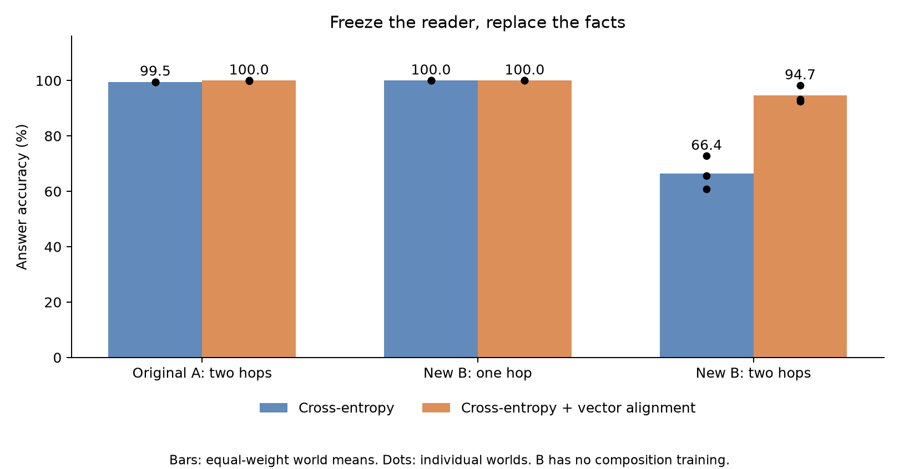

统一表示臂的全池收益为**+28.27个百分点**，六个配对全部为正，范围+22.66至+34.57。三个世界的两臂均值依次为72.80%/98.24%、60.79%/93.31%、65.58%/92.43%，对应收益+25.44/+32.52/+26.86个百分点。不是初始化或上下文数量增加了独立世界数；不据这三个世界给出普遍定律或查询级显著性声明。

两臂共同“两条B单跳都正确”的覆盖率为100%，条件分数与全池相同。真正改变两跳答案的覆盖为99.48%，其正确率为66.51%/94.78%，结论不依赖少量新旧答案碰巧相同的路径。保留旧MLP的低分及换入后答案转向，支持模型实际使用了替换的内容。精确键的A/B事实MLP也全部单跳正确；B记忆输出与目标输入向量的平均余弦为0.7159/0.999992，说明表示约束落实，但相似度本身不是机制证明。接口使用归一化，原始输出范数差异不能直接解释行为差距。

**结论与范围。** 在这个可替换记忆、共享词向量和两次连续调用的受控架构中，增加统一MLP输出表示目标，提高了只接受单跳训练的新事实的组合可用性。普通CE仍有66.39%成功，不能称精确向量对齐是必要条件；统一表示也未达到所有端点满分。处理同时改变MLP函数及围绕它学习的注意力，尚未唯一归因于向量方向、局部鲁棒性或某一个内部通道。它不是普通端到端文本预训练，也没有检验任意关系选择、新实体词表或局部编辑保持；此前文本严格目标约2%的结果不被本轮替代。

**开发修改保留。** 初版仅对75%头实体训练A组合，CE/统一表示的A留出两跳为73.83%/57.03%，B两跳43.95%/77.64%。为聚焦新事实替换，开发校准仅扩大A组合监督至全部头实体，四个A/B事实MLP完全复用，只新增两个读取器；A两跳98.44%/100%，B两跳55.66%/92.68%，B单跳100%/99.61%。正式比较随后冻结，开发不进入确认均值；没有根据正式结果调参、删运行或挑节点。[初版汇总](development-artifacts/memory-reuse-v1/development/report/summary.json)与[校准汇总](development-artifacts/memory-reuse-v1/calibration/report/summary.json)单列。

**复核与成本。** 正式24个A/B端点、84个读取器节点的221184项答案重载核验通过，logit最大差为0；全部配对初值、上下文流、共享MLP及冻结参数检查通过。开发与校准另有28节点，合计294912项重载答案核验。7项关键契约测试及五个新增Python文件的静态/格式检查通过。正式24个事实MLP和12个读取器共240000次记忆更新、48000次调用更新；开发额外40000次记忆更新、16000次调用更新，校准复用不重复计入。正式读取器输入122.88M token，单跳/两跳监督12.288M位置，估算矩阵乘FLOPs约8.78×10¹³；进程计时合计1033.13秒包含评价和存盘，三路并发，不是独占GPU墙钟。一次缺锁启动在产生任何模型前被拒绝，随后正常启动；正式零失败。

完整[逐模型表](development-artifacts/memory-reuse-v1/confirmation/report/endpoints.csv)、[世界与配对汇总](development-artifacts/memory-reuse-v1/confirmation/report/summary.json)、[学习曲线](development-artifacts/memory-reuse-v1/confirmation/report/learning.png)、[PDF主图](development-artifacts/memory-reuse-v1/confirmation/report/comparison.pdf)、[审计](development-artifacts/memory-reuse-v1/confirmation/audit.json)、[环境](development-artifacts/memory-reuse-v1/environment.json)和[完成清单](development-artifacts/memory-reuse-v1/completion-manifest.json)均保留。训练与重载入口分别为`scripts/run_memory_reuse.py`、`scripts/audit_memory_reuse.py`；配置为`configs/memory-reuse-confirmation-v1.json`。历史精确复现使用各阶段锁内源码。

<a id="text-structure"></a>
## 组合练习结构与跨事实迁移

**2026-10-01 UTC，3条32k开发与12条8k新世界训练全部完成。** 本轮从“已有事实会不会用”推进到“练习结构能否令用法迁移”。复用既有完整词元文本预训练模型；[开发契约](development-artifacts/text-structure-v1/development-plan.md)和[确认契约](development-artifacts/text-structure-v1/confirmation-plan.md)在各阶段启动前冻结。

固定128人物、32专家、32地点与640原子事实。64背景人物的256条首事实，以及16背景专家的32条后事实参加组合；另32背景人物及32背景后事实只接受原子训练。32目标人物指向另外16专家，目标人物与专家在主两臂均没有组合经历，地点答案集合共享。restricted将关系搭配限制为8种、两个支持块；broad覆盖16种、一个连通块。两臂均256条唯一训练链，每条首事实组合使用1次、每条后事实8次，词元边际、答案分布、基础单跳、初值、行索引流与物理计算预算精确匹配。改变的是联合搭配分布，不归结为无条件“更多多样性更好”。

先取两主臂与64条预定正对照链的首尾对并集，其所有替代关系路径均排除于共同评价。正式不训练正对照，仍沿用这个预定保留规则。三个新世界148011/148012/148013各两个初始化；主终点固定8k，先平均世界内初始化、再世界等权，不做查询级显著性或挑最佳节点。

| 共同评价集合 | 受限搭配 | 广搭配 | 广−受限（百分点） |
| --- | ---: | ---: | ---: |
| 单跳事实 | 100.00% | 100.00% | 0.00 |
| 自身训练组合 | 100.00% | 100.00% | 0.00 |
| 两事实有组合经历的新链 | 15.11% | 66.30% | +51.19 |
| 仅首事实有组合经历 | 1.16% | 1.73% | +0.58 |
| 仅后事实有组合经历 | 62.50% | 89.71% | +27.21 |
| 背景中两事实都无组合经历 | 7.49% | 7.36% | −0.13 |
| 严格目标：独立人物与专家，仅原子训练 | **1.57%** | **2.16%** | **+0.59** |
| 严格目标自主两次单跳调用 | 100.00% | 100.00% | 0.00 |

分数为完整答案＋句号＋EOS；答案正确率与之相同，低分不是终止符失败。严格目标的正确答案概率受限/广搭配为1.91%/2.22%；相关两原子均正确子集覆盖100%，条件成绩与全池相同。严格测试分母428/415/426，覆盖各世界512条完整目标路径的83.59%/81.05%/83.20%。预定全512条目标路径复核为1.66%/2.12%，两次调用仍100%，结论不依赖正对照保留对的排除。

| 新世界 | 熟悉事实新链的效应（百分点） | 严格目标的效应（百分点） |
| --- | ---: | ---: |
| 148011 | +65.35 | +0.12 |
| 148012 | +62.50 | +0.24 |
| 148013 | +25.71 | +1.41 |

熟悉事实收益在三个世界均为正。严格目标世界均值也均为正，但六个初始化配对仅4个为正、2个为负，整体仍只有约2%正确，不能写成用法已普遍迁移或严格目标效应完全为零。全部两事实都有经历的新链，恰属restricted从未训练的关系对，因此+51.19个百分点直接支持扩展搭配支持的收益，不独立证明抽象调用算法。预定支持内/外分组中，只有后事实有经历时，restricted在支持内97.79%、支持外27.21%，broad分别90.49%/88.93%；扩大支持有收益，也有熟悉搭配上的取舍。只有首事实有经历及严格目标在两类关系对中均低。[次要分组与完整目标评价](development-artifacts/text-structure-v1/confirmation/secondary-analysis.json)保留分母，不把角色行当成相同查询的独立因果消融。

**开发与正式预算不同。** 开发三臂32k全部完成，positive每目标人物加入2条组合链共64条，改变目标监督与曝光，仅作可学习性参照。4k三臂单跳/训练组合均100%；8k熟悉事实新链受限/广为31.07%/73.79%，严格目标均1.42%，positive严格目标8.51%。32k熟悉事实新链降至0%/12.62%，positive未见目标链16.78%而监督目标链100%。因此在确认数据产生前选择8k作为正式终点，保留开发全部后期退化；有限正对照没有建立目标新链满分的上界。[开发曲线](development-artifacts/text-structure-v1/development/comparison.png)单列，不将开发选择包装为确认结果。

模型427392参数，宽128、两块重复两次、dropout0.1；AdamW lr3e-4、weight decay0.1、warmup1000，梯度裁剪1。每步64原子＋64组合、1024个监督token，除BOS/PAD外完整下一词元损失，无QA微调或显式桥实体监督。GPU2、FP32/TF32开启，三任务并发。主两臂正式每原子800次、每训练链2000次，逐事实角色曝光一致。开发＋正式共192000更新、196608000监督token、估算3.09398×10¹⁵ FLOPs；训练段累计1046.87秒，评价和审计另计。

14项相关测试、五个新增Python文件的静态/格式检查、GPU捕获恢复与三步普通更新核验通过。15个端点、99个节点的530559条计分复算、全部1155个端点预测数组的同精度重载及采样/初始化审计通过；无删臂、失败或重试。见[开发完成核验](development-artifacts/text-structure-v1/development/verified-completion.json)、[正式完成核验](development-artifacts/text-structure-v1/confirmation/verified-completion.json)、[汇总](development-artifacts/text-structure-v1/confirmation/summary.json)与[环境](development-artifacts/text-structure-v1/environment.json)。

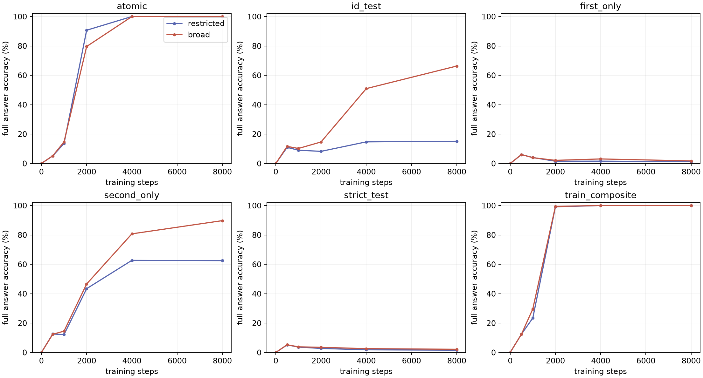

本轮支持训练支持结构塑造局部组合泛化，仍不能解释严格目标事实为何难以直接组合，也不证明架构不可能。目标人物与专家隔离、输出值共享、单token模板及小模型是适用范围；未建立稳定且实用的严格迁移差异，因此不追加层/供体扫描来替代缺失的迁移证据。

<a id="text-loss-source"></a>
## 继续预训练的损失来源与参数变化

**2026-10-01 UTC完成4条开发、24条冻结后续训练和72个参数互换状态。** 本轮问题是：单跳已经掌握后，哪些继续预训练信号会维持或损害组合使用，以及哪些参数变化参与这一效应？方法沿用 [Physics 3.2](https://arxiv.org/html/2309.14402) §2、§4及附录B/C对事实提取和知识操作的区分。原文涉及分类、比较、部分提取和逆向搜索，其hint条件在任务训练中混合50%带提示与50%不带提示，不是仅在测试时给真值，也不是证明所有Transformer不能组合。本轮扩展为训练损失干预，不称原版bioS复现。

从此前全部六个P1 32k端点分支：既有三个世界×两个初始化，每个复制权重、Adam状态、采样器与CPU/CUDA随机状态，固定继续4096步。父世界此前已观察，因此称冻结后续比较，不称新世界确认；开发另报。四臂输入、标签、位置、注意力、逐批抽样、dropout随机流与计算形状相同，仅切换损失来源。A为原子文本，包括基础事实及配对记录的两条原子句；B为背景人物组合文本；N为中性记录，所有臂一直保留。每批分别有1120/288/576个监督token，所有条件都除以共同分母1984，不对剩余损失重新归一化。A包含实体、关系、标点及EOS，并非只训练事实答案。

| 保留的损失 | 未见目标组合 | 全部单跳 | 背景留出组合 | 背景训练组合 |
| --- | ---: | ---: | ---: | ---: |
| AB：原子＋背景组合＋中性 | **84.59%** | **100.00%** | 98.45% | 99.94% |
| A：原子＋中性 | **43.10%** | **100.00%** | 84.46% | 96.02% |
| B：背景组合＋中性 | 65.69% | 71.09% | 95.37% | 100.00% |
| N：仅中性 | 69.27% | 95.76% | 93.08% | 99.11% |

固定终点、目标全池的完整答案＋句号＋EOS评分，先平均世界内初始化、再世界等权。共同来源目标组合82.88%、单跳100%；AB相对来源平均+1.72个百分点，但并非每个配对都改善。所有条件均未加入目标人物的组合答案监督，测试首尾实体对及所有路径继续全局留出。

**事实训练与组合训练存在强交互。** 保留原子训练时加入背景组合损失，AB−A为+41.50个百分点，三个世界+35.78/+57.14/+31.58，全部六配对为正。没有背景组合损失时，A−N为−26.17个百分点，全部六配对为负；有背景组合损失时，AB−B反而为+18.91，全部六配对为正。B−N平均−3.58，方向不一致。预定原子/组合平均因素效应分别为−3.63/+18.96个百分点，交互为+45.08；原子平均效应在第三个世界略正，不能只挑A−N称为原子训练普遍有害。

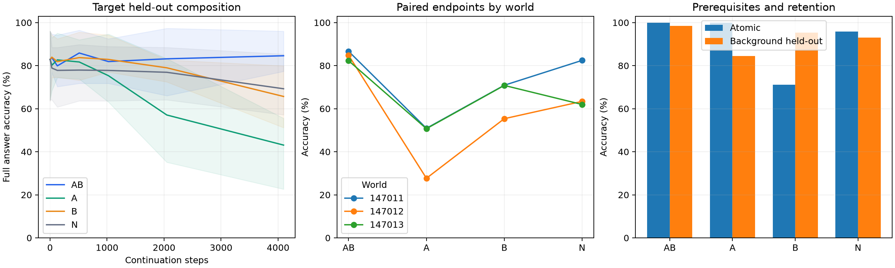

图中阴影是六个模型的最小—最大范围，不是置信区间。四臂终点共同的“两条所需原子事实均完整答对”子集覆盖69.46%，AB/A/B/N为85.70%/42.57%/71.49%/71.11%；这是处理后筛选，只作补充，不替代全池比较。B与N存在单跳退化；A的背景组合也下降，保留一般组合计算退化的竞争解释，不能把A的全部损失归为目标事实的特殊接口问题。N仍有中性梯度、继承的Adam动量及weight decay，不是无更新对照。非零监督数量和梯度大小变化属于处理，尚未单独隔离语义信息或梯度方向。

**同祖先分支的参数互换提供部分内部因果证据。** 开发后、读取后续结果前冻结A与N的双向交换：token embedding及绑定读出、全部注意力投影、全部MLP、归一化与位置四组互斥且覆盖全部参数，另设self和all对照。每配对12个状态；不训练适配器、不选择最好层，重复调用仍共享参数。下表为目标全池准确率：

| 换入另一分支的参数组 | A接收N参数 | N接收A参数 |
| --- | ---: | ---: |
| 不换 | 43.10% | 69.27% |
| token及绑定读出 | 41.12% | 67.33% |
| 注意力 | 61.10% | 70.60% |
| MLP | **70.96%** | **61.43%** |
| 归一化与位置 | 42.34% | 72.43% |
| 全部 | 69.27% | 43.10% |

A换入N的MLP后平均提高27.87个百分点，六个配对均为正，单跳仍100%；背景训练/留出为99.84%/94.55%。反向交换平均下降7.84个百分点，但六配对中有两对改善，不能宣称一致双向转移。A换注意力平均提高18.01个百分点且单跳100%。这将训练处理与MLP和注意力参数的条件性作用联系起来，仍不能区分事实表征变化、输入使用方式与模块共同适应，更不证明事实只存于MLP或完整中介比例。共同祖先减少坐标不一致，但不能消除混合参数的分布失配。

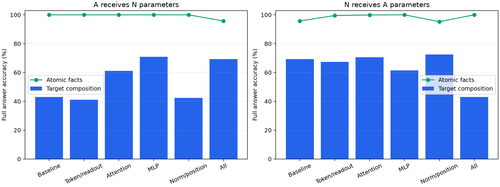

开发来源82.61%，AB/A/B/N为69.57%/32.85%/71.50%/82.13%，原子100%/100%/69.84%/98.75%；未并入上述均值。28条训练共114,688步、224个节点；28端点重载、602,112条节点预测、72个后续参数状态的134,256条预测独立核验通过，11项相关测试通过。初值、父检查点、抽样重放、随机流、自替换和全替换均通过。总可见监督槽227,540,992，实际非零监督token 146,800,640，估算矩阵乘FLOPs 1.8481×10¹⁵；训练进程计时之和680.7秒，不含启动、评测和写盘，也不是独占GPU时长。训练前修复冻结路径错误，四次缺锁启动未产生更新；参数分析格式修订发生在后续分析前，两版锁均保留。

结论限于427,392参数的模板语言模型、既有三个世界和4096步继续预训练。已从能力差距推进到“损失来源→参数变化→组合行为”的部分因果解释；下一问题是这些参数变化影响事实内容还是组合过程，尚未建立自然大模型机制或解释原32k训练轨迹的每一步退化。

证据：[预注册](development-artifacts/text-loss-source-v1/preregistration.md)、[开发后冻结方案](development-artifacts/text-loss-source-v1/followup-plan.md)、[参数互换计划](development-artifacts/text-loss-source-v1/weight-analysis-plan.md)、[执行源码锁](development-artifacts/text-loss-source-v1/weight-analysis-execution-lock.json)、[全量汇总与审计](development-artifacts/text-loss-source-v1/followup/report/summary.json)、[逐配对效果](development-artifacts/text-loss-source-v1/followup/report/paired-effects.csv)、[参数互换逐格结果](development-artifacts/text-loss-source-v1/followup/report/weight-cells.csv)、[完成与预算清单](development-artifacts/text-loss-source-v1/completion-manifest.json)。

<a id="text-pretraining"></a>
## 受控文本预训练：上下文、组合结果与内部状态

**3条开发、三个新世界×两个初始化×三臂的18条确认训练全部完成。** 本轮从随机初始化进行完整下一词元训练，无后续QA适配；每条32k步，全部9个节点保留。目标是把旧答案监督下的“使用经历”比较推进到受控文本预训练，区分事实重复、可联合访问的上下文与组合结果监督，再检验首跳状态的因果贡献。文献方法及边界见[当前计划](hebbian-learning-plan-v1.md#pretraining-knowledge-use)。

采用128人物、32桥实体、32地点的类型分离随机图；640条原子事实，四种首关系与四种后关系。全部条件共享原子句和背景人物的组合训练。目标人物的非测试路径上，P0将两条原子句隔离；P1仅打开两句间的因果注意力，token、位置、标签、逐批抽样完全不变；P2再以等长组合结果替换第三条独立中性记录。P2因此也改变组合监督、实体曝光及内容熵，不是与P1信息完全匹配的比较。第三条记录均不能访问前两条，排除就地抄写答案。测试首尾实体对及其所有关系变体在训练共同上下文中全局留出。

固定32k终点，先平均世界内两个初始化、再三个世界等权。主指标要求答案、句号、EOS全部正确；没有按成功查询筛选：

| 目标事实的预训练呈现 | 未见目标组合 | 背景留出组合 | 正确答案平均概率 |
| --- | ---: | ---: | ---: |
| P0：独立原子陈述 | **69.16%** | 98.91% | 67.55% |
| P1：相同原子句联合上下文 | **82.88%** | 98.65% | 79.93% |
| P2：再加入非测试组合结果 | **99.84%** | 99.91% | 99.19% |

P1−P0为 **13.72个百分点**，三个世界分别+26.89/+20.24/-5.98；P2−P1为 **16.96个百分点**，三个世界分别+8.44/+17.56/+24.88。P1−P0在前两个世界为正，但第三个世界两个初始化都为负，不能称为稳定的跨世界收益。P2−P1在六个初始化配对中均为正；[逐配对结果](development-artifacts/text-pretrain-v1/report/paired-effects.csv)保留分母对应的原始单元。全部确认端点的单跳事实均为100%；背景训练的P0/P1/P2为100%/99.98%/100%，保留P1的一条训练错误。相关两条单跳均答对的子集覆盖100%，所以当前终点差异不能归于缺失所测单跳事实。三个世界仍是较少的独立重复，不以数千查询制造显著性。开发62.32%/82.61%/100%单列，不并入确认均值。

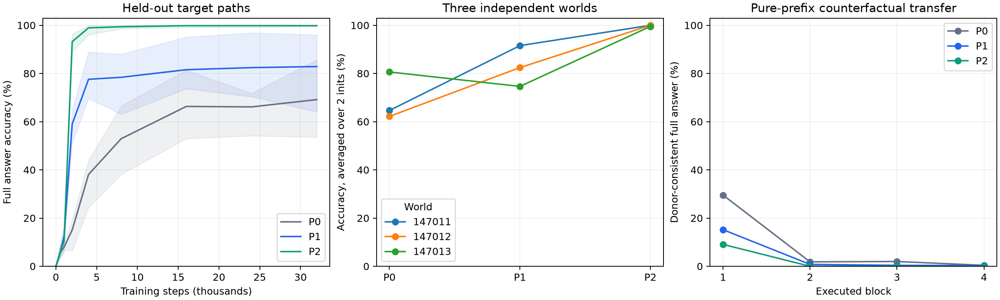

左图阴影是六个模型的最小—最大范围，不是置信区间。事后查看已保存轨迹，第三个世界的P1−P0从4k的+34.21个百分点变为16k的+4.31、24k的+8.37、32k的−5.98：共同上下文的早期优势没有保持到预定终点。这提示学习过程值得解释，未据此改选最好节点或追加训练。

**训练组织的行为效应得到支持，唯一内部通道尚未建立。** 在固定原问题与后关系的情况下，将另一个人物的纯首跳状态替换到首关系词位置；供体只见BOS、人物、所有格、首关系，不见后关系或答案。开发曾比较相邻两个位置，正式比较预先固定首关系位置、16k/32k节点、全部四个执行块及三种组件。供体按图与固定随机种子选择，不按模型成绩选取，所有臂共享。

同桥供体覆盖85.81%，代表相同首关系与中间实体的另一个背景人物。在这一固定子集上，P0的未干预正确率为76.06%，第一执行块完整状态替换后为91.36%；只替换MLP增量为87.34%。它支持部分失败可以由可交换的首跳状态改善，但子集原本就比完整目标池容易，不能把子集提升当作全池收益。

不同桥供体覆盖100%，其正常完整问题的首尾对本身也在训练中留出。第一执行块完整状态替换后，P0/P1/P2的答案正确转向供体路径比例为29.53%/15.18%/9.07%；未干预的偶然转向为0.39%/0.31%/0.00%，正常反事实完整输入为98.98%/98.69%/99.90%。只替换MLP的转向为15.60%/4.06%/2.45%，注意力增量为1.26%/1.67%/0.00%。这些比例反而随三臂原任务平均正确率提高而下降，且个别P2初始化的单点转向很低，不能把更高组合准确率等同于更强的这一个局部通道。各层、两节点、全部概率和原答案保持均见[完整干预表](development-artifacts/text-pretrain-v1/report/mechanism-cells.csv)及[组件图](development-artifacts/text-pretrain-v1/report/mechanism.png)。末块该位置到答案位置不存在后续因果路径，其无效是结构性对照，不是学得的机制。

完整状态和MLP增量中仍含供体身份及注意力历史；注意力替换保持本块原MLP输出不变，是输出增量的受控替换。当前证据支持首跳状态参与后续计算、部分状态可交换，不支持知识只存于MLP、唯一桥实体编码、该位置必要性或训练效应的中介比例。P0/P1/P2的后继事实均可参加共同背景组合，主要操纵目标首跳事实的使用经历，未独立识别两条边各自的贡献。

**范围与成本。** 单词级英文模板、427,392参数、两块循环两次的受控语言模型；不是自然大模型或原版bioS规模复现。每条63.488M有效监督token，三臂计算形状与估算FLOPs相同。21条训练总计1,333,248,000有效token、1.0829e+16估算矩阵乘FLOPs、4,362.0秒训练进程计时之和；并发计时不是独占GPU时长，也不包括评测、启动及写盘。

26项相关测试、21个端点GPU重载、508,032条节点预测独立复算、36个确认节点的187,656条干预预测核验通过。配对初值、P0/P1全部训练token/标签/位置、抽样状态重放、文档边界、首尾留出及自替换身份检查均通过，端点重载概率最大差为0。全部矩阵完成，无删臂或按确认结果改预算。[开发契约](development-artifacts/text-pretrain-v1/preregistration.md)、[确认冻结方案](development-artifacts/text-pretrain-v1/confirmation-plan.md)、[汇总](development-artifacts/text-pretrain-v1/report/summary.json)和[完成清单](development-artifacts/text-pretrain-v1/completion-manifest.json)保留来源、代码快照、计分、预算及复现信息。

<a id="bios-same-weight"></a>
## bioS同权重的事实提取与规则使用

**18个既有端点的同权重诊断已完成，零新增训练。** 对既有两个世界的固定32名开发人物，分别在S/M/MP的预训练、QA适配、任务适配权重上测原生续写、日期/出生地QA，以及月份奇偶的直接回答、真值输入和自主提取后回答。每个端点384条生成，共6,912条；独立核对真值、实际生成日期输入及评分，并与原轨迹的384条预训练续写复核，共7,296项通过。

原生续写确实会随适配变化。S的原生日期/出生地在预训练端点为100%/100%，QA适配后为32.81%/78.13%；同一适配权重下，常用QA问法为14.06%/1.56%。因此此前跨端点的“100%原生记忆与弱QA”比较不能当作同权重的纯接口差异：本次同时观察到原生续写下降和仍然存在的提取差距。原生出生地前缀提供真实生日；续写按属性token评分，QA按规范化完整文本评分，分数不完全同口径。适配只训练LoRA；本次对12个适配/任务端点逐项比较，每个模型147个预训练主体张量均与来源完全相同。因此这是增加适配器后原生调用行为的变化，不能表述为预训练主体记忆被擦除；这也不证明适配器是唯一的提取瓶颈。

以下为MP任务端点，每列同一权重、同一批64人记录；两个世界等权，两个问法分别报告：

| 问法 | 日期QA完整文本 | 直接月份奇偶 | 自主生成日期后判断 | 给定真实日期判断 |
| --- | ---: | ---: | ---: | ---: |
| 常用问法view0 | 96.88% | 76.56% | 100.00% | 100.00% |
| 留出问法view1 | 59.38% | 35.94% | 93.75% | 100.00% |

日期完整文本错不代表月份一定错，因此自主奇偶可高于日期QA完整率。真值输入的规则任务已有效，自主日期使用真实生成而非偷换为真值；这支持分步提取接口能改善知识使用。它同时改变提示、离散中间文本和计算量，不能唯一定位隐藏状态失配或MLP存储。MP同一任务权重的原生日期/出生地续写为57.81%/56.25%，进一步提示不同测量接口不能互相替代。预训练/QA适配阶段未学习奇偶格式，保留其零分但不解释为不具备规则推理机制。

[主体参数保持核验](development-artifacts/bios-same-weight-v1/base-parameter-audit.json)、[冻结对象与来源](development-artifacts/bios-same-weight-v1/lock.json)、[全量分组与审计](development-artifacts/bios-same-weight-v1/summary.json)、[逐世界评分](development-artifacts/bios-same-weight-v1/scores.csv)保留S/M/MP和全部阶段；这仍是固定开发人物诊断，不是新增世界确认。

<a id="grok-loop-supervision"></a>
## 循环终点监督与长循环动力学

**2026-09-30（美国中部时间）完成2条开发与12条冻结后续续训，以及18个模型的R1…64动力学检查。** 后续比较使用既有三个世界×两个初始化，非新世界确认；开发不并入均值。两臂都从同一个两跳L2、训练R2的128k端点复制模型、AdamW、采样流与随机状态，展开R4，再续训8k。单终点目标为ℓ4，多终点为(ℓ2+ℓ3+ℓ4)/3；ℓ仍只监督最终实体与EOS，OOD事实没有组合训练曝光。两臂执行相同三支读出与反传图，单终点的早期分支权重为零。

**训练目标改变了OOD表现随计算轮数的曲线；本配方没有建立普遍的循环稳健性改善。** 以下为先平均世界内初始化、再世界等权的完整答案+EOS准确率，固定8k终点：

| 模型 | OOD R4 | OOD R8 | OOD R16 | 原子R4 | 原子R8 | ID留出R4 |
| --- | ---: | ---: | ---: | ---: | ---: | ---: |
| 续训前共同来源 | 38.50% | 17.42% | 4.42% | 95.77% | 30.24% | 99.54% |
| 单终点续训 | 11.10% | 41.33% | 46.74% | 99.98% | 99.02% | 99.90% |
| 多终点续训 | 28.08% | 42.58% | 34.48% | 99.97% | 98.29% | 99.86% |

多终点相对单终点在R4高16.98个百分点，三个世界分别+18.35/+18.81/+13.79；R8只高1.25个百分点，三个世界为0.00/+2.30/+1.46，六个初始化配对中两对为负。R16则低12.26个百分点，三个世界均为负。相对各自共同起点，两种续训的R4都下降；多终点也下降10.42个百分点，未保住原有R4能力。预定d=Acc8−Acc4在单/多终点分别为+30.23/+14.50个百分点，交互为−15.73个百分点：此时d代表额外循环收益，不能称“减少了退化”。两臂共同的R8提升也不能单独归因为最大训练轮数增加，因为本轮未加入保持R2目标的等预算续训。

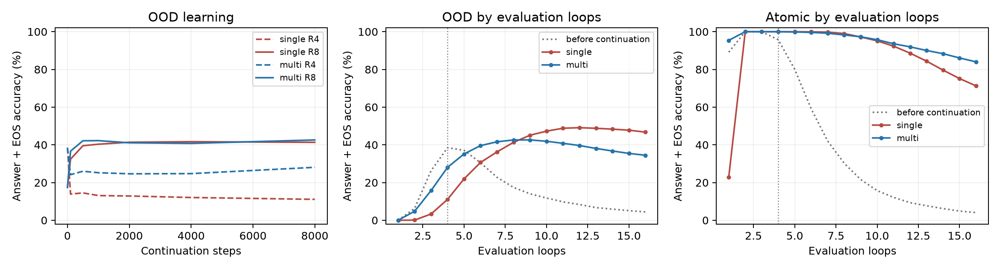

R4→R8的逐题转移在六个模型合计3,102条模型×查询记录中，单终点正确→错误8、错误→正确946；多终点分别75与525。各臂的R4正确集合不同，不能把这两个丢失计数当作同一群体的因果比较。共同来源R4正确子集的世界等权覆盖为38.50%；在此固定子集，单/多终点R4为18.11%/43.58%，R8为56.30%/58.75%。全部[逐题转移计数及覆盖](development-artifacts/grok-loop-supervision-v1/followup-report/transitions.csv)保留；不同初始化的同一查询不作为独立世界。

单终点的受监督训练组合R4及多终点R2/3/4均100%，目标操作已有效；不是训练没学会导致无明确收益。原子仍有少量错误，不能概括为全部前提满分。两臂OOD在R4/R8/R16的自产EOS均100%，这些轮数的主差异不来自结束格式。延至R64，单/多终点答案正确率为13.37%/11.44%，完整答案+EOS为5.94%/10.37%；极长循环出现EOS失分，需要另报。

**有限轮数内，原始状态未显示趋于不动点；归一化变化减小与持续残差增长同时发生。** 对全部纯OOD问题，仅输入问题前缀，测完整共享块组边界的前三个位置；PAD后缀不纳入状态统计。每一步的绝对步长为RMS(hᵣ−hᵣ₋₁)，幅度为RMS(hᵣ)，归一化变化为最终LayerNorm输出之差。逐题先测，再模型内平均、世界等权：

| 模型 | 绝对步长 R32→R64 | 状态幅度 R32→R64 | LayerNorm后步长 R32→R64 |
| --- | ---: | ---: | ---: |
| 原来源 | 0.3245→0.3235 | 9.086→19.279 | 0.0276→0.0080 |
| 单终点 | 0.2075→0.2095 | 5.399→11.171 | 0.0665→0.0288 |
| 多终点 | 0.1723→0.1672 | 5.173→10.281 | 0.0458→0.0188 |

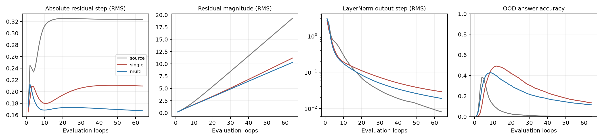

这是持续原始状态移动与近似线性幅度增长，不是原始状态已停止变化。相对步长变小不能区分这两种情况；例如hᵣ=h₀+r·v在v≠0时并不收敛，相对步长却可随r减小。原来源R64的归一化变化最小，OOD答案正确率却仅0.10%，也说明“变化小”本身不保证答案可靠。上述例子解释诊断歧义，不把它当作模型的已识别方程。R≤64检查不能证明无限轮数不收敛、不能建立吸引性，也没有证明范数增长导致错误；后两项需要有限干预。

方法借鉴及已读章节见[方法修订](hebbian-learning-plan-v1.md#loop-method-revision)，沿用NeurIPS 2022训练因素拆分及长循环检查思路，但不是其progressive loss完整复现。本轮结论限于小型符号模型、既有三个世界和固定8k预算，既不宣布多终点训练无效，也不放弃不动点问题。下一项最小训练对照是保持R2目标的等预算续训，分离继续训练与改变监督终点；动力学问题保留，并优先区分残差幅度增长和归一化轨迹变化的因果作用。

47项相关测试通过；14端点、98节点的2,478组评分独立复算一致，210组端点生成重载完全一致。配对初值、采样顺序、事实曝光及捕获恢复核验通过；18个动力学模型R1…16的无答案前缀读出与原评价一致，R32/R64另存自主生成，36组长循环生成与270项状态统计独立复算通过。新增训练合计112k步，计时训练276.9秒（不含启动、评测及文件写入），矩阵乘FLOPs估计1.107×10¹⁵。开发结果单列，零删臂、零按结果改预算。见[冻结设计](development-artifacts/grok-loop-supervision-v1/preregistration.md)、[开发后的冻结决定](development-artifacts/grok-loop-supervision-v1/followup-plan.md)、[全部世界与配对汇总](development-artifacts/grok-loop-supervision-v1/followup-report/summary.json)、[动力学原始统计](development-artifacts/grok-loop-supervision-v1/dynamics/summary.json)及[完成与预算清单](development-artifacts/grok-loop-supervision-v1/completion-manifest.json)。

<a id="grok-usage"></a>
## 事实的组合使用经历

**四臂开发及三个新世界的12条确认训练全部完成，共16条128k训练、320个学习节点。** 本轮从同一随机图、相同初始权重和固定留出问题出发，改变哪些事实参加组合训练，直接检验单跳掌握之外的训练经历是否影响未见组合。设计复用[Grokked Transformers的方法与附录](https://arxiv.org/html/2405.15071v3)，在既有小模型实现上增加同事实角色交换与构成原子重复控制；不是自然文本预训练的直接复现。

图含128实体、16关系、1024条原子事实。全图先固定留出10%的完整两跳查询；再将事实划分为背景512条、A/B各256条。所有臂均训练全部原子事实和背景组合。A臂额外训练包含A事实、且不含B事实的组合，B臂相反；repA/repB把对应角色组合替换为其两条原子，各用半损失权重。每批32个基础原子、112个背景组合及112个角色槽；主臂实际256条，重复臂368条。成对重复控制逐批匹配构成事实次数，不等于相同文本、监督信息、梯度或FLOPs。各臂固定两块循环两次的L2、宽128、128k步，从头进行答案与EOS监督。

**三个新世界的固定128k终点。** AA与BB分别指两条边均来自A或B事实组的完整留出查询；每世界先将两个事实组等权，再对三个世界等权，初始化均固定为14601。表中各行对应相同问题的不同训练角色，全部计分包含答案与EOS，未按训练结果筛题。

| 该事实组的训练经历 | 未见同组组合正确率 | 平均正确答案概率 |
| --- | ---: | ---: |
| 参加组合训练（A臂AA、B臂BB） | 100.00% | 99.87% |
| 只接受基础单跳（B臂AA、A臂BB） | 3.01% | 3.39% |
| 对应构成原子重复（repA臂AA、repB臂BB） | 25.01% | 21.93% |
| 重复另一组原子（repB臂AA、repA臂BB） | 6.99% | 6.83% |

同题角色效应为**+96.99个百分点**，三个世界依次+97.11/+97.19/+96.67；组合相对匹配重复为**+74.99个百分点**，依次+70.80/+73.79/+80.37。确认世界146011/146012/146013的AA题数为59/53/50，BB为42/54/43；主组合臂全部答对，对应重复控制的AA正确数为19/16/8、BB为11/12/10。完整世界及九格数据见[确认汇总](development-artifacts/grok-usage-v1/report-confirmation/summary.json)与[逐世界差值](development-artifacts/grok-usage-v1/report-confirmation/world-effects.csv)。

所有AA/BB主比较的相关原子均正确，条件覆盖100%，主差值不依赖剔除失败原子。全量结果中，世界146012的repA有一条B组原子错误：单跳1023/1024、自主调用799/801，其余11端点均100%。错误边不在该世界AA/BB池中；它影响全池两题，直接组合全池467/801，相关原子均正确子集467/799，覆盖99.75%。另有世界146013的repB背景训练组合1841/1842，其余背景训练全对；所有端点的背景留出为97.63%–100%，不能把训练前提概括为每项无例外满分。

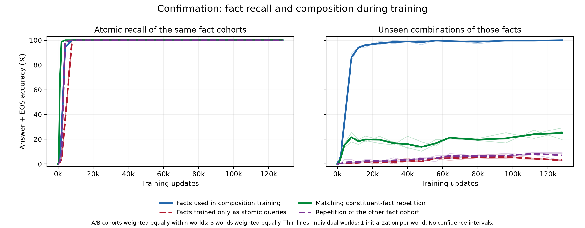

粗线为世界等权均值，细线为各世界；左侧是同一事实组的全部原子提取，右侧为同组留出组合。12k节点各训练角色的单跳均100%，但组合使用/仅单跳/对应重复的组合正确率为94.15%/0.93%/18.37%；单跳掌握早已接近饱和，组合轨迹仍持续分离。完整节点与[连续概率图](development-artifacts/grok-usage-v1/report-confirmation/role-aligned-probability-confirmation.png)均保留，不挑最好节点；原子重复的部分收益也保留。三个独立图、单一初始化的结果支持该训练设置下的规律，不能称跨初始化稳健性或自然大模型定律。

以下为开发世界146001、初始化14601的固定128k终点，单列而不加入确认分母；同列比较相同问题。

| 训练臂 | AA（59题） | BB（56题） | 背景组合（207题） | 全部留出（844题） |
| --- | ---: | ---: | ---: | ---: |
| A组合训练 | 100.00% | 5.36% | 99.52% | 76.07% |
| B组合训练 | 10.17% | 98.21% | 100.00% | 76.90% |
| A构成原子重复 | 28.81% | 7.14% | 100.00% | 60.43% |
| B构成原子重复 | 11.86% | 25.00% | 100.00% | 63.27% |

同一AA池的A−B为+89.83个百分点，同一BB池的B−A为+92.86，两个事实组等权为**+91.34个百分点**。相对对应原子重复，AA为+71.19、BB为+73.21，等权为**+72.20个百分点**。所有臂的1024条原子、1877条背景训练组合及844题自主两次调用均100%；因此“相关原子均答对”子集覆盖全池，不能把组合差距简单归于单跳知识缺失。自主调用提供关系分解并增加计算，与单次直接组合的条件不同。

两阶段结果支持：在此图规模、架构和训练预算下，语料中的组合使用经历影响同一事实的未见组合，构成原子重复不足以解释全部收益。处理发生于整个训练语料，伴随上下文、监督和优化变化，尚未分离其内部来源，也不定位独立知识模块。完整九格及连续概率保留；全池包含未共同训练的A/B混合链，不能把AA/BB满分称为任意事实普遍组合。

**本次机制复盘的事后描述。** 独立复算12个确认端点的108个九格单元，答案、EOS、真值及逐题概率与既有汇总一致，跨臂测试查询相同；零新增训练或前向。按A/B角色对齐后，第一/第二条事实都参加过组合、仅第一条参加、仅第二条参加、两条都未参加的世界等权正确率为100.00%/41.48%/48.94%/3.01%。中间两行来自AB/BA混合链，不能与AA/BB直接作同题四格因果比较；“第一/第二”指测试位置，原训练并未限制事实的使用位置。它提示应同时检查两条事实的使用条件，不定位某个模块或证明独立位置效应。[逐世界分母与来源哈希](development-artifacts/knowledge-use-review-v1/summary.json)、[全部单元](development-artifacts/knowledge-use-review-v1/endpoint-cells.csv)、[复算入口](development-artifacts/knowledge-use-review-v1/recompute.py)。

[开发报告](development-artifacts/grok-usage-v1/report/summary.json)保留80个节点、1600个split×node、540560项独立检查，缺项和错误均为零；末端直接预测重载及[自主调用重载](development-artifacts/grok-usage-v1/development-autonomous-audit.json)全部一致，逐事实曝光用独立随机流复算。[确认计划](development-artifacts/grok-usage-v1/confirmation-plan.md)在三个新世界生成前冻结，使用同一初始化与全部原设置，不据新世界成绩调参；开发不加入确认分母。原始预测、权重、实际数据及源代码位于`results/grok-usage-v1/`。

确认报告另有240节点、4800个split×node和1621680项独立计分/曝光检查，缺项与错误均为零。[确认输入复核](development-artifacts/grok-usage-v1/confirmation-input-audit.json)核对12个初始权重逐参数一致、同世界评价完全相同、180个源码快照哈希及冻结时序；直接终点重载和[自主调用重载](development-artifacts/grok-usage-v1/confirmation-autonomous-audit.json)均通过。[完成清单](development-artifacts/grok-usage-v1/completion-manifest.json)记录全部16运行、预算与证据哈希。相关85项测试分批通过；新增源码lint/format通过，活动树仍保留一项既有E501，历史冻结源码未因全仓lint而改写。

复算入口（不训练；开发与确认分目录）：

```bash
.venv/bin/python scripts/report_grok_usage.py --phases development --configs configs/grok-usage-development-v1.json --out docs/development-artifacts/grok-usage-v1/report
.venv/bin/python scripts/report_grok_usage.py --phases confirmation --configs configs/grok-usage-confirmation-v1.json --out docs/development-artifacts/grok-usage-v1/report-confirmation
```

训练入口为`scripts/execute_grok_usage.py --config <配置> --gpus <GPU编号> --per-gpu <并发数>`，完整运行自动跳过，未完成运行从最后保存节点恢复；首次运行先验证配置指定的源码锁。自主调用重载使用`scripts/audit_grok_usage_calls.py --config <配置> --device cuda:0 --output <新审计文件>`，保留已有审计，使用原FP32/TF32与物理batch。

<a id="grok-loop"></a>
## Looped Transformer：共享参数与知识组合

**全部训练、审计、机制评价与循环扫描已完成。** 15条开发、6条开发敏感性及90条独立世界正式训练，共111个GPU终点审计、210个模型×split机制评价与42个L1/L2循环扫描通过完成核验，缺项和错误为零。正式结果支持共享同一组Transformer参数学会两、三、四跳的ID留出组合；仅接受单跳训练的事实能否用于新组合，仍是更难的检验。见[主汇总](development-artifacts/grok-loop-v1/main-report/summary.json)与[完成清单](development-artifacts/grok-loop-v1/completion-manifest.json)。

本批采用标准的固定共享块循环：`h[t+1]=Fθ(h[t])`，词嵌入仅在入口应用，末端LN与读出仅在最后应用；不增加中间实体监督、离散桥注入或自适应停机。方法来源及已读论文方法/附录见[执行契约](development-artifacts/grok-loop-v1/preregistration.md)。宽128、4头，从零训练，每条128k步。每批固定32条原子与224条组合，全部1024条事实接受单跳训练；其中768条ID事实参与组合训练，256条OOD事实只接受单跳训练。评价分别使用完整ID留出池与纯OOD事实链，混合链未纳入主评分。此75/25划分、组合覆盖与采样配方区别于历史实验，不能将新四跳满分与旧11.84%解释成纯架构收益。

记C1/C2为普通1/2层，CD为普通D层，L1为1块循环D次，L2为2块循环D/2次；两、三跳D=4，四跳D=6。CD/L1/L2等展开深度且残差初始化方差一致；C1/L1与C2/L2分别等参数，但`scaled_effective`初始化尺度随D变化，因此等参数比较不是只改变计算次数。C1/L1为218240参数，C2/L2为416512参数，CD在D4/D6时为813056/1209600参数。

**正式三个世界、每世界两个初始化。** 每格为128k终点的完整ID留出组合 / 纯OOD组合答案+EOS正确率（%）；先平均世界内初始化，再世界等权。100.00为四舍五入，逐运行精确值见主汇总。

| 模型 | 两跳 | 三跳 | 四跳 |
| --- | --- | --- | --- |
| C1 | 30.38 / 0.84 | 57.56 / 0.68 | 38.24 / 0.75 |
| C2 | 96.44 / 1.42 | 97.61 / 0.82 | 83.03 / 0.70 |
| CD | 98.14 / 1.61 | 99.32 / 0.84 | 100.00 / 0.94 |
| L1 | 100.00 / 4.55 | 100.00 / 0.78 | 100.00 / 0.94 |
| L2 | 99.86 / 6.29 | 99.99 / 1.02 | 100.00 / 0.84 |

等展开深度下，两跳L1/L2相对CD的OOD配对收益为+2.94/+4.68个百分点，三个世界均为正，世界差范围分别为+1.82…+4.08及+3.26…+5.53；三/四跳没有相近幅度的收益。循环模型ID组合接近满分不等于任意已学单跳事实都能组合。正式四跳C1的训练组合仅64.17%，C2为98.17%，其低留出分数不能全部归因于组合接口。除两跳CD一条原子事实错误外，正式单跳及外部自主逐跳调用均100%，相关条件子集与覆盖仍另报。完整[学习曲线](development-artifacts/grok-loop-v1/main-report/grok-loop-confirmation-v1-learning-steps.png)、[计算量曲线](development-artifacts/grok-loop-v1/main-report/grok-loop-confirmation-v1-learning-flops.png)及[配对表](development-artifacts/grok-loop-v1/main-report/paired-comparisons.csv)保留所有臂及预算比较。

**开发世界145001、单初始化。** 下表均为128k终点的完整答案+EOS正确率，每格依次为ID / OOD（%），不能与正式世界合并平均。

| 模型 | 两跳 | 三跳 | 四跳 |
| --- | --- | --- | --- |
| C1 | 34.30 / 1.67 | 58.63 / 0.67 | 39.71 / 0.57 |
| C2 | 95.52 / 1.30 | 96.53 / 0.59 | 86.54 / 0.38 |
| CD | 98.21 / 1.30 | 99.03 / 0.59 | 100.00 / 0.83 |
| L1 | 100.00 / 3.52 | 100.00 / 0.50 | 100.00 / 0.61 |
| L2 | 100.00 / 6.48 | 100.00 / 1.18 | 100.00 / 0.64 |

四跳C1的训练组合仅66.19%，其低分不能全归因于留出组合接口。开发15端点、405个学习节点与26655项审计全部通过，GPU同精度重载最大NLL差为0；[独立审计](development-artifacts/grok-loop-v1/development-endpoint-audit.json)、[开发学习曲线](development-artifacts/grok-loop-v1/development-report/grok-loop-development-v1-learning-steps.png)、[计算量曲线](development-artifacts/grok-loop-v1/development-report/grok-loop-development-v1-learning-flops.png)保留全部模型。

**初始化与深度敏感性。** 在同一两跳开发世界补齐D4/D8、深度缩放/残差零初始化、CD/L2的八格比较，复用两个原开发端点，仅新增六条训练。D4两种初始化的L2 OOD为6.48%/7.22%；D8为18.70%/17.59%，四个L2的ID均100%。对应CD的OOD依次1.30%/1.30%/1.67%/1.48%。这说明该开发收益对两种初始化都存在，但不构成多世界验证；[完整敏感性报告](development-artifacts/grok-loop-v1/sensitivity-report/summary.json)单列，正式主矩阵未据此替换为D8。

**固定权重的循环扫描。** 正式36个及开发6个L1/L2均扫描R=1…8，训练时循环数的预测与原终点逐例核对通过。下表是正式两跳L2（训练R=2）的世界等权均值；ID使用固定probe，OOD与单跳使用全量池，全部为答案+EOS正确率（%）。

| 测试R | 单跳 | ID组合probe | OOD组合 |
| ---: | ---: | ---: | ---: |
| 1 | 89.14 | 0.11 | 0.00 |
| 2（训练设置） | 100.00 | 99.86 | 6.29 |
| 3 | 99.93 | 99.93 | 26.28 |
| 4 | 95.77 | 99.54 | 38.50 |
| 5 | 80.08 | 93.00 | 37.09 |
| 6 | 59.08 | 76.13 | 30.51 |
| 7 | 42.01 | 56.90 | 22.77 |
| 8 | 30.24 | 40.37 | 17.42 |

该收益在独立世界中复现了开发两跳L2的趋势（R=2/3/4时OOD为6.48%/23.52%/36.48%）。所有模型、跳数和循环数的[完整扫描](development-artifacts/grok-loop-v1/mechanism-report/summary.json)与曲线均保留，不选择最高测试分作为主成绩。这是固定权重下改变执行过程，不是重新训练不同R；额外循环属于固定R训练之外的执行变化，不能由其失败证明架构能力上限或长度外推不可能。

**正式机制证据。** 同r1纯前缀供体只输入`[h′,r1]`，不含后续关系或答案；在全部执行层分别替换注意力增量、MLP增量、两者和完整残差。下面固定列第一执行层、不同bridge供体合格的ID子集，每格为完整残差 / 仅MLP的新路径答案+EOS正确率（%）。

| 架构 | 两跳 | 三跳 | 四跳 |
| --- | --- | --- | --- |
| CD | 50.26 / 20.34 | 94.18 / 75.08 | 69.71 / 43.44 |
| L1 | 99.43 / 43.17 | 100.00 / 97.10 | 99.98 / 73.98 |
| L2 | 93.94 / 34.27 | 97.60 / 84.85 | 99.62 / 77.77 |

三种架构的供体合格覆盖相同，两/三/四跳分别为82.92%/87.60%/69.66%；不替代全量组合主成绩。L1未干预新目标命中均为0%，完整反事实输入均100%；仅注意力增量为0.81%/0.04%/1.03%。同bridge完整状态替换保留原答案100%，其同子集基线也100%；供体和基线的其它分层见完整报告。开发L1完整残差为99.47%/100%/100%，仅MLP为51.73%/97.53%/73.22%，单列而不与正式世界合并。

第一层“两增量”与完整残差等价属于工程恒等检查，不是两份独立证据。MLP增量已经依赖供体注意力，混合后不重算该MLP；不能由注意力单独替换弱或联合替换强，推出知识独占于MLP或必然协同。它支持早期r1状态携带下游可用的首跳相关信息，不证明该状态只编码桥实体。[全部层与控制](development-artifacts/grok-loop-v1/mechanism-report/summary.json)包括所有五种架构、ID/OOD、未干预新目标基线、完整反事实输入、同bridge控制、原子前提及缺失供体。

对既有预测的[事后分组分析](development-artifacts/grok-loop-v1/atomic-timing-supplement.md)发现，开发L1在R=1时的ID原子答案均100%，OOD原子答案为17.97%/10.55%/8.98%；但此时两类原子的答案+EOS均为0%，必须区分知识答案和格式。后续循环能提取OOD原子仍不保证组合成功。补充登记时已有1条正式扫描完成，因此明确列为探索性重分析；未新增训练或前向，也未按结果筛循环数。它描述输出层面的可提取时间，不自动定位内部知识编码。

该探索汇总现已覆盖全部42个L1/L2模型，无缺失模型×循环数组。正式L1的R=1时ID原子答案仍均100%，OOD原子答案为21.35%/12.50%/8.20%，两类答案+EOS均为0%。[全量分组及图](development-artifacts/grok-loop-v1/atomic-timing-report/summary.json)保留全部R；新增正式数据不改变其事后探索性质。

正式比较固定3个新世界×2初始化×3跳数×5架构，[确认计划](development-artifacts/grok-loop-v1/confirmation-plan.md)与[源码锁](development-artifacts/grok-loop-v1/confirmation-lock.json)在正式数据/训练前保存。先平均世界内初始化，再世界等权，不把种子、查询和执行层当独立世界。[数据审计](development-artifacts/grok-loop-v1/confirmation-data-diagnostics.json)保留全部9个数据条件；四跳OOD有效反事实供体覆盖仅1.81%–3.53%，这部分干预须按小子集解释。三世界、固定图规模与训练预算仍不足以推出普遍架构定律、知识容量上限或自然大模型机制。

**执行与收尾复核。** 正式90端点的159,930项审计、6条敏感性的10,488项审计全部通过，GPU同精度重载最大NLL差均为0；[正式审计](development-artifacts/grok-loop-v1/confirmation-endpoint-audit.json)、[敏感性审计](development-artifacts/grok-loop-v1/sensitivity-endpoint-audit.json)保留全部运行与配对采样检查。全批111条训练、2,997节点、210机制评价和42循环扫描经源码锁、权重/预测身份及完整矩阵核验，缺项和错误均为零。本次67项后处理、收尾与报告相关测试通过；新增前向仅补齐原冻结矩阵，未新增训练或改选样本。原中断记录与重试保留于[后处理目录](development-artifacts/grok-loop-v1/postprocess/)，本次恢复监控终态为complete。

<a id="grok-loop-continuous"></a>
### 既有轨迹的连续评分复盘

**111条轨迹、2,997个登记节点及18,093个split×node记录全部恢复，无缺项。** 本次为事后只读分析，不新增前向、训练或检查点选择。对每题恢复`exp(-答案NLL)`后平均，得到完整词表下正确答案概率；不以平均NLL的指数代替逐题概率平均。教师强制正确答案后的EOS概率、自产答案后的EOS正确率与答案正确率分别保留；自主逐跳调用没有保存NLL，只报告原硬评分。开发、敏感性和正式世界分开汇总，完整ID留出池仅在终点评价，曲线仍使用原固定probe。

正式两跳L2的OOD正确答案概率为**6.1473%**，答案+EOS正确率为**6.2932%**；三/四跳L2的对应概率为1.0085%/0.8452%。正式终点各split的自产EOS均100%；从1k步起已保存正式节点上的答案正确率与完整正确率一致，终点教师强制EOS概率也接近1。因而这里的OOD低分不是大量正确答案因EOS丢分，也没有被硬阈值掩盖的高平均正确答案概率。

90条正式OOD轨迹中，9条出现相邻节点概率下降≥1个百分点，4条在连续三个节点上下降和回升均≥1个百分点，没有两段均≥5个百分点的案例。最大相邻下降为2.623个百分点（两跳L1，世界145013、初始化14502，88k→96k）；随后104k回升。已保存轨迹没有观察到原论文量级的大幅模式切换；晚期每8k步一个节点，不能排除节点之间更快的波动，也不能把轨迹/初始化计作90个独立世界。

证据：[六页完整图册](development-artifacts/grok-loop-continuous-v1/continuous-trajectories.pdf)、[连续节点表](development-artifacts/grok-loop-continuous-v1/nodes.csv)、[涨落事件](development-artifacts/grok-loop-continuous-v1/decline-rebounds.csv)、[汇总](development-artifacts/grok-loop-continuous-v1/summary.json)及[独立哈希复核](development-artifacts/grok-loop-continuous-v1/verification.json)。全部历史硬评分/NLL、ID/OOD原子划分与共享数据组一致；3,455项输入哈希通过核验。

<a id="grok-loop-same-bridge"></a>
### 两跳同桥实体：ID与OOD纯首跳供体

**5个开发端点校准、30个既有正式端点的后续干预全部完成，零新增训练。** 问题是：真实桥实体相同、第二关系与目标不变时，参与过组合训练的第一跳事实所产生的状态，是否更容易被下游使用？先在145001世界校准五架构，再冻结145011–145013三个世界×两初始化×五架构的128k端点比较；训练时循环数保持原值。这是已知模型上的预定后续分析，不是新的独立世界确认。[执行前契约](development-artifacts/grok-loop-same-bridge-v1/preregistration.md)保留主比较及解释边界。

接收问题仍是完整原纯OOD池`[h,r1,r2]`，供体只输入`[h′,r1]`，同r1、同真实桥实体b、不同h，且h′不等于最终答案。ID供体首边有实际首位置组合训练曝光，OOD供体两位置组合曝光均为零；按图与训练记录枚举全部候选，不按模型评分选择。固定第一执行层r1位置，分别换注意力增量、MLP增量、两者或完整残差；混合后不重算当前块MLP。PAD和物理批次用于匹配历史数值形状，补齐重复项不保存、不评分。

主表为**同一共同查询子集上的答案+EOS正确率（%）**：先在每题内平均全部供体对，再平均世界内初始化，最后三个世界等权。完整原OOD池基线另报，不能用本表替代全池成绩。

| 架构 | 同子集基线 | ID完整状态 | OOD完整状态 | ID−OOD（百分点） | 仅ID MLP | 仅OOD MLP |
| --- | ---: | ---: | ---: | ---: | ---: | ---: |
| C1 | 0.40 | 0.40 | 0.40 | 0.00 | 0.40 | 0.40 |
| C2 | 0.40 | 4.39 | 2.88 | +1.51 | 3.99 | 1.84 |
| CD | 0.79 | 3.98 | 0.00 | +3.98 | 3.92 | 1.44 |
| L1 | 8.25 | **40.58** | 8.06 | **+32.52** | 24.92 | 7.30 |
| L2 | 9.68 | **38.94** | 12.33 | **+26.61** | 22.12 | 9.39 |

L1的完整状态ID−OOD三世界差依次+36.46/+28.38/+32.74个百分点，L2为+29.17/+25.68/+25.00；C2在第一世界为−5.21，方向不稳定。连续概率也支持状态改变：L1共同子集正确答案概率由基线6.65%变为ID35.74%/OOD8.58%，L2由8.53%变为31.71%/11.32%。仅MLP的ID−OOD差为L1+17.62、L2+12.73个百分点；仅注意力为+4.88/+9.89个百分点，全部组件保留，不挑最好组件作主成绩。较广的ID供体可用池覆盖世界平均33.39%，L1/L2相对各自同池基线为6.16%→41.33%及9.35%→35.41%；它不属于共同子集的ID/OOD直接比较。

**覆盖与前提。** 三世界共同供体为16/515、37/521、42/515题，覆盖3.11%/7.10%/8.16%，世界等权6.12%；对应独特原首跳事实8/18/18条、后继事实8/19/19条。共同题目在CD/L1/L2全部初始化中，接收两原子及所有候选供体原子都答对，按此前提分组没有缩小主子集。正常完整反事实只改h′，仍取同b/r2/t；ID反事实是未训练的ID首跳+OOD后继混合链，其L1/L2完整率为46.29%/48.39%，仍未全面学会。双方正常反事实均答对的条件子集极小，不作为主证据；全池、单侧可用、共同、无供体以及基线正确/失败分组全部留存。

**机制含义。** 在这些图定义题目上，单跳提取正确仍不足以保证前缀状态可供组合使用；换入同桥的ID状态能明显改善循环模型，支持组合训练身份相关的首跳状态可用性差异。不同供体仍是不同查询/事实，未对同一事实随机重训，不能把差值解释成纯训练曝光的因果效应。完整状态也未全面修复，不能把全部失败定位于第一跳；接收r2状态、其它位置和后续组合使用仍可能参与。MLP增量本身依赖供体注意力，且完整残差保留查询身份信息；结果不证明知识独占于MLP、状态是纯桥实体编码或一轮一跳，也不检验原论文的容量竞争猜想。

**复核与产物。** 全部35端点、23条件、10评价子集齐全；自身/原纯前缀置换与基线一致，第一层both=full，C1因没有后续执行层而所有供体置换恒等，参数哈希保持。历史答案/EOS逐例重现；独立CPU审计从原始logits和生成结果复算概率、margin、硬评分及全部分组，194,103项检查错误为零，概率最大误差4.97×10⁻¹⁴，历史NLL最大差1.99×10⁻⁶。71项相关测试通过。开发中两次数值形状校准失败及旧锁/产物均保留，最终[数值修订](development-artifacts/grok-loop-same-bridge-v1/execution-amendment-v3.md)固定运算形状，未改变供体或放宽最终恒等要求。[主比较图](development-artifacts/grok-loop-same-bridge-v1/report/paired-outcomes.pdf)、[组件图](development-artifacts/grok-loop-same-bridge-v1/report/component-contrasts.pdf)、[覆盖图](development-artifacts/grok-loop-same-bridge-v1/report/coverage.pdf)、[完整汇总](development-artifacts/grok-loop-same-bridge-v1/report/summary.json)、[各世界对比](development-artifacts/grok-loop-same-bridge-v1/report/world-contrasts.csv)、[独立复核](development-artifacts/grok-loop-same-bridge-v1/independent-verification.json)与[完成清单](development-artifacts/grok-loop-same-bridge-v1/completion-manifest.json)提供分母、来源与执行记录。原始逐例输出位于`results/grok-loop-same-bridge-v1/execution-v3/`。

<a id="grok-depth"></a>
## 极小Transformer：知识组合泛化的形成与深度

**结论：在这套随机事实任务和固定训练配方下，两层小Transformer能够直接回答大多数未训练过的两跳组合，一层具有部分泛化，加宽到接近相同参数量仍未追上。** 这是受控训练中的行为结论，不是自然大模型机制或一层模型不可能性的证明。

方法借鉴[Grokked Transformers are Implicit Reasoners](https://arxiv.org/html/2405.15071v3)及[作者实现](https://github.com/OSU-NLP-Group/GrokkedTransformer/tree/734ca654ec7a71dd6737d640407fac14491d538c)，保留随机关系图、95/5原子边划分、组合训练与尾实体/EOS监督；微型化差异见[逐项对应](development-artifacts/grok-depth-v1/literature-alignment.json)。每世界128实体、16关系、1,024条原子事实，全部用于单跳训练。973条ID事实产生组合候选，先留出10%测试，再抽5,838条训练组合；三个确认世界分别有748、760、769条ID测试组合。51条OOD事实只参与单跳训练，其两跳链作为次要诊断，混合ID/OOD链未纳入。

模型为普通GPT2式因果Transformer，从头训练，4个注意力头、dropout 0.1，无显式中间答案。采用AdamW、学习率10⁻⁴、权重衰减0.1、预热2,000步、batch 256；均匀遍历原子与组合训练集，每条固定128,000步，即32,768,000个样本、每条训练记录约4,775次曝光。2层/4层在一个开发世界校准成功后，[锁定配置与源码](development-artifacts/grok-depth-v1/confirmation-lock.json)，在3个新世界×2初始化上配对比较1层/2层；满足预登记条件后执行[宽一层对照](development-artifacts/grok-depth-v1/wide-control-decision.json)，宽180在确认前仅按参数量选择，未按其结果调参。

**损失口径。** 两跳及后续三/四跳均随机初始化，只对最终实体和EOS计算等权交叉熵；提示词元不直接计损失，也不提供中间实体监督。这是从零开始的答案监督训练，监督位置类似常见SFT，训练过程没有预训练后微调的切分。训练EOS时输入正确答案，评价EOS时输入模型自产答案；[精确定义与采样配比](hebbian-learning-plan-v1.md#training-objective)统一说明。

18条确认轨迹的原子事实、训练组合及外部两次调用完整正确率均为100%，ID/OOD原子子集也分别100%。下表是固定终点的**答案加EOS**正确率；先在世界内平均两个初始化，再平均三个独立世界。初始化重复不当作独立世界。

| 架构 | 参数量 | ID留出组合均值 | 三个世界均值范围 | 首次连续三次评测≥90%的起点（六次运行） |
| --- | ---: | ---: | ---: | --- |
| 1层，宽128 | 218,240 | 27.78% | 27.30%–28.14% | 128,000步内未达到 |
| 1层，宽180 | 419,220 | 24.52% | 23.40%–25.55% | 128,000步内未达到 |
| 2层，宽128 | 416,512 | 96.44% | 95.33%–97.13% | 40,000–60,000步 |

T90是连续三个已登记评价节点均≥90%的首节点，每2,000步评价一次；六次两层结果依次为46k、42k、48k、60k、40k、46k，对应每事实约1,492–2,238次曝光。它是节点分辨率下的学习时间，不要求此后所有节点始终达标：一条两层轨迹在48k–52k满足定义后，54k曾回落至88.55%。一层未达标是预算内未观察到，不能据此计算精确加速倍数。两层首次同时达到原子/训练组合≥99%在6k–8k步，此时留出组合已约34%–54%，随后继续提高；不把曲线描述成此前完全没有泛化的突然觉醒。

**计算预算对照。** 使用预先规定的共同FLOP上限，每臂取不超过上限的最后评价节点，不挑最优点或插值。窄一层128k步为27.78%，两层64k步为93.06%，实际估算计算量分别1.628×10¹⁴与1.591×10¹⁴ FLOPs。宽一层128k步为24.52%，两层126k步为96.24%，分别3.172×10¹⁴与3.132×10¹⁴ FLOPs。宽一层参数比两层多0.65%，仍明显落后，说明仅补足总参数量没有补足本配方下的组合泛化；不排除优化条件、宽深参数配置或初始化的影响。FLOPs按实际padding形状估算矩阵计算，含反向、不含逐元素与优化器开销，不是硬件计数或能耗。

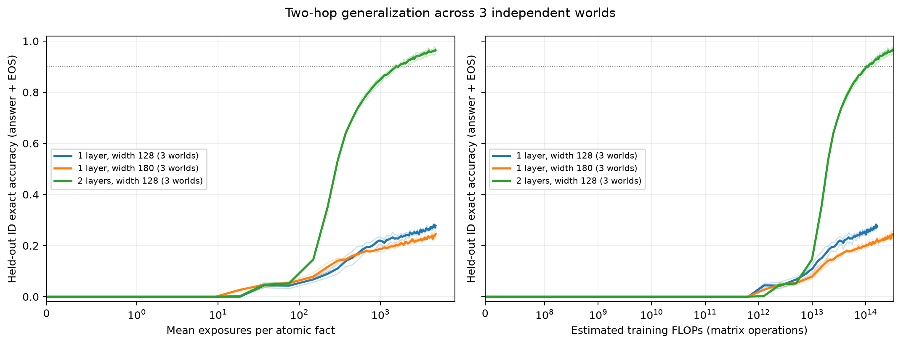

左图横轴是每条原子事实的平均训练曝光，右图是估算训练FLOPs；粗线为世界均值，浅线为各世界。完整逐运行曲线及评分见[汇总](development-artifacts/grok-depth-v1/summary.json)、[全部节点表](development-artifacts/grok-depth-v1/learning.csv)和[终点表](development-artifacts/grok-depth-v1/endpoint-table.csv)。开发世界的2层/4层分别97.08%/98.94%，T90分别42k/22k，仅作开发参照，不混入正式深度统计。

**范围与后续。** ID成功检验的是有组合训练经验的事实上的未见组合，不等于只记住任意单跳事实就能普遍组合。OOD链每世界仅21/23/20条，三种架构均表现很低；两层世界平均仅2.28%，尽管这些原子事实全部能提取。外部两次调用提供了已知关系分解并增加计算，不能当成同等条件的一次前向成功。该批正式比较1/2层，不支持线性深度定律，也没有证明内部“一层做一跳”。历史twohop-depth-v1与本轮同时改变图生成、组合覆盖、采样比例、优化、格式和预算，因此新成功不能单独归因于延长旧实验训练。首跳接口干预已完成；随后获授权启动的3/4层学习成本扩展在下一节单列。

**执行与复核。** 开发2条、确认18条全部完成，每条69个评价节点；共256万次更新、6.554亿次样本曝光、25.236亿有效输入token，估算5.736×10¹⁵ FLOPs。训练段累计2,198.32秒，评价21.35秒，均为并行运行求和；首条运行开始至末条结束的UTC跨度28分56秒，不含此前实现/检查及之后审计整理，不能当整项工作耗时。相关32项测试通过；图重放与普通训练、恢复连续性核验通过。开发2个及正式18个终点独立GPU重载，答案/EOS/目标/NLL重现一致；正式1,242个节点的曝光、参数与独立FLOPs复算及18组配对通过。开发另保留CPU重载的NLL舍入差异（离散预测一致），不放宽其阈值；同精度GPU复核通过。执行预算、逐运行计时、源码与审计哈希见[完成清单](development-artifacts/grok-depth-v1/completion-manifest.json)，审计见[开发](development-artifacts/grok-depth-v1/endpoint-audit-development.json)与[确认](development-artifacts/grok-depth-v1/endpoint-audit-confirmation.json)。

复现与只读汇总入口（训练器跳过已完成运行；历史运行不得覆盖）：

```bash
PYTHONPATH=src .venv/bin/python scripts/execute_grok_depth.py primary_runs --gpus 2 5
PYTHONPATH=src .venv/bin/python scripts/execute_grok_depth.py conditional_wide_runs --gpus 2 5
.venv/bin/python scripts/report_grok_depth.py
CUDA_VISIBLE_DEVICES=2 PYTHONPATH=src .venv/bin/python scripts/audit_grok_depth.py --phase confirmation --device cuda:0
.venv/bin/python scripts/finalize_grok_depth.py
```

<a id="depth-hop-extension"></a>
## 两跳深度扩展与三/四跳探索（已完成）

**跨批次完整对比图。** [总览图](development-artifacts/hop-depth-comparison-v1/overview.png)并列两跳、三跳的一到四层结果、宽一层对照与四跳六层校准，未运行的格子明确留空。[八页图册](development-artifacts/hop-depth-comparison-v1/complete-comparison.pdf)包含终点、学习曲线、计算成本、逐运行表及历史附图：当前43条唯一训练、2,967个评价节点，以及单列的历史28条训练、196个节点；开发世界与独立世界分开，复用基线不重复计数。配套[完整终点表](development-artifacts/hop-depth-comparison-v1/endpoints.csv)、[全部学习节点](development-artifacts/hop-depth-comparison-v1/learning.csv)、[世界等权汇总](development-artifacts/hop-depth-comparison-v1/group-summary.csv)和[来源校验清单](development-artifacts/hop-depth-comparison-v1/manifest.json)可复核。两跳曲线使用全量留出集，三/四跳曲线使用固定1024题probe，后者全量终点另标；历史批次不与当前配方合并平均。

2026-09-30用户授权。两跳新增3/4层、宽128的12条轨迹，复用原3世界×2初始化及2层基线；保持数据、样本流、优化与128k步预算。预先固定配对2层最终准确率、90%和95%三个连续三节点门槛，并列学习步数、曝光、参数量与FLOPs。12条新增训练及独立复核全部完成。[执行契约](development-artifacts/grok-depth-extension-v1/preregistration.md)、[逐运行汇总](development-artifacts/grok-depth-extension-v1/summary.json)。

下表均值先平均世界内两个初始化，再对三个世界等权，范围为六条运行的范围。达到门槛指连续三个登记节点达标的首节点，这些门槛附近每2000步评价一次；没有插值、没有挑最好节点。

| 两跳模型 | 参数量 | 128k终点均值 | T90均值（范围） | T95范围 | 达到配对2层128k分数的平均步数（范围） |
| --- | ---: | ---: | --- | --- | --- |
| 2层（历史基线） | 416,512 | 96.44% | 47k（40–60k） | 74–112k，5/6达标 | 仅2/6连续达标，不计算整体均值 |
| 3层 | 614,784 | 98.40% | 27.33k（26–32k） | 42–68k，6/6达标 | 68.33k（58–88k） |
| 4层 | 813,056 | 98.29% | 22k（18–28k） | 30–54k，6/6达标 | 57k（48–68k） |

各配对参考准确率为94.74%–97.19%，不是统一96.44%门槛。3/4层都以更少更新达到各自参考，但不能用128k除以新达标时间声称精确学习加速：历史2层自身只有2条连续达到其最后一个节点的分数，另4条在预算内没有按三节点规则达到。用共同90%门槛比较则无删失，2/3/4层平均训练FLOPs分别1.1684/1.0114/1.0812×10¹⁴；4层更新数更少，3层的平均计算量更低。达到配对参考所用FLOPs平均是原2层固定128k预算的79.46%/88.03%，各有1/6条超过该预算，不能称每个配对都节省计算。

在原2层128k的共同FLOP上限内，取3层84k、4层64k的最后合格节点，其平均准确率为97.06%/97.04%，基线96.44%。这些比较仍同时改变深度、参数量和初始化尺度，不是等参数实验。新增终点原子事实与外部两次调用全部100%；训练组合有一条3层错1/5838题（99.983%），其余均100%。

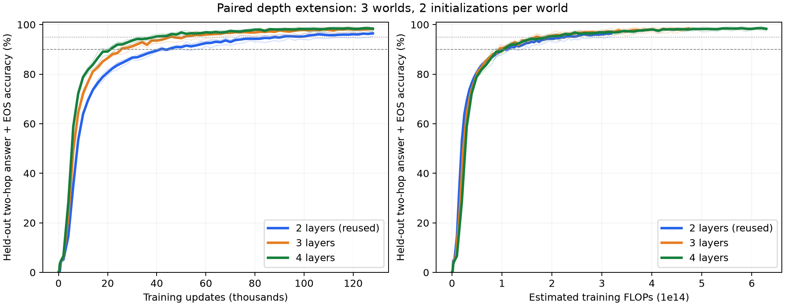

两跳扩展的38项执行前测试及2项分析测试通过；12终点同精度GPU重载、828个节点的计分/曝光/FLOPs与全部阈值独立复算通过，冻结输入保持一致。新增153.6万次更新、3.932亿样本、估算6.616×10¹⁵ FLOPs；训练段累计2007.07秒，矩阵UTC跨度41分53秒，均不含此前实现与之后复核。完整记录见[独立审计](development-artifacts/grok-depth-extension-v1/endpoint-audit.json)及[完成清单](development-artifacts/grok-depth-extension-v1/completion-manifest.json)。

三/四跳独立构造完整路径，训练全部原子及指定跳数组合，仅监督最终实体与EOS，不给中间答案。先在开发世界144001校准三跳4层和四跳6层，phi=6、每条128k步。每节点固定1024题probe，终点评价全部预留题；模型和优化复用原实现，但实际padding长度分别为5/6。长链组合覆盖随跳数降低，因此首轮失败不直接解释成层数不足。

首轮phi=6的三跳4层/四跳6层，全量留出分别9.91%/7.15%，但单跳、训练组合、外部逐跳调用均100%。随后保持深度、优化、128k步和完整测试集，把组合训练样本由5838增至23352（phi=24）；三跳4层升至95.03%，四跳6层为11.84%。这四条开发端点同精度GPU重载及372项审计通过。

固定三跳phi24设置，补齐1/2/3层；四种深度共用同一图、训练数组、完整测试集、初始化编号及样本流。下表均为开发世界144001、单初始化、128k步终点，主指标覆盖全部5629题。

| 三跳模型 | 参数量 | 全量留出 | 固定1024题probe | T90（probe） | 估算训练FLOPs |
| --- | ---: | ---: | ---: | --- | ---: |
| 1层 | 218,240 | 18.00% | 16.02% | 预算内未达到 | 2.019×10¹⁴ |
| 2层 | 416,512 | 72.62% | 70.31% | 预算内未达到 | 3.964×10¹⁴ |
| 3层 | 614,784 | 88.42% | 87.99% | 预算内未达到 | 5.909×10¹⁴ |
| 4层 | 813,056 | 95.03% | 94.04% | 100k | 7.855×10¹⁴ |

2/3/4层的原子事实、训练组合、外部自主三次调用均100%；1层分别99.80%/97.71%/99.80%，其训练组合未完全拟合，不能把失败全解释成留出组合瓶颈。开发中仅4层达到全池90%标准，据此选定3/4层并在新世界训练前锁定，在两个新世界144011/144012、每世界1初始化上独立复核；[边界选择与契约](development-artifacts/grok-multihop-v1/boundary-confirmation-plan.json)在新世界模型训练及评分前冻结，不根据其结果改边界或预算。这个选择不意味着4层是三跳的理论最少层数。

**相近计算下的开发对比（事后分析）。** 以3层128k的5.9094×10¹⁴ FLOPs为上限，4层最后一个不超预算的登记节点为96k、5.8911×10¹⁴ FLOPs。二者在同一1024题probe上分别87.99%与89.26%，差1.27个百分点；不能将这里的子集分数与全池终点混比。三/四层计算量曲线接近，因此固定步数下的90%边界尚不说明同等计算下必须4层。

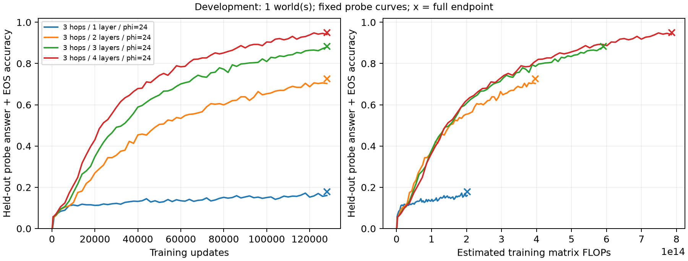

曲线使用固定probe，叉号为全部5629题终点。[七条开发汇总](development-artifacts/grok-multihop-v1/summary.json)、[七端点GPU重载审计](development-artifacts/grok-multihop-v1/all-development-endpoint-audit.json)保留全部分数；648项检查通过，另对483个保存节点的留出子集评分独立复算一致。

**三跳独立世界复核。** 两个未用于开发选深度的世界、每世界一个初始化，固定phi24及128k步，三/四层四条训练全部完成。下表为全部预留题的答案加EOS正确率；均值对世界等权，不与开发世界合并。

| 世界 | 全池题数 | 3层 | 4层 | 4层减3层 |
| --- | ---: | ---: | ---: | ---: |
| 144011 | 5677 | 89.92% | 97.48% | +7.56个百分点 |
| 144012 | 5571 | 90.65% | 96.61% | +5.96个百分点 |
| 两世界均值 | — | 90.29% | 97.04% | +6.76个百分点 |

四条的原子、训练组合及自主三次调用均100%。4层在固定1024题probe上的T90分别76k/86k；3层两条均未连续三节点达到90%，但第二世界的全池终点已超过90%。全池终点达标与曲线连续达标是两个指标，不相互替代。**3层已能在一个独立世界达到工作标准；4层在这两个世界更充分地学会，不能据此声称三跳必须4层。** 目前只有两个独立世界、每世界一个初始化，未建立普遍最少层数或每层一跳的机制结论。

同样按3层128k的FLOP上限做事后比较，4层取96k；两新世界各自共同probe上的3/4层准确率为89.16%/93.75%、91.02%/92.87%，世界平均90.09%/93.31%，差3.22个百分点。开发世界只差1.27个百分点，单列保留；不混入独立世界均值。这支持当前两个新世界的深度收益并非仅由更多训练计算解释，仍未隔离参数量与初始化尺度的作用。

三跳独立复核的[完整汇总](development-artifacts/grok-multihop-v1/confirmation/summary.json)、[学习曲线](development-artifacts/grok-multihop-v1/confirmation/learning-confirmation.png)及[四端点GPU审计](development-artifacts/grok-multihop-v1/confirmation-endpoint-audit.json)均已完成，368项检查通过；另对276个保存节点的probe计分独立复算一致。多跳共7条开发加4条确认，14项CPU契约测试、GPU图重放/恢复预飞及11个端点重载通过，无剩余运行。新增140.8万更新、3.604亿样本，估算8.333×10¹⁵ FLOPs；分组成本、源码、审计与UTC跨度见[完成清单](development-artifacts/grok-multihop-v1/completion-manifest.json)，不混入两跳批次。

四跳6层phi24全42556题为11.84%，原子、训练组合、外部四次调用均100%；尚未建立达到90%的参照。本轮四跳停在开发校准，不启动浅层矩阵，也不据此声称至少需要7层。

增加组合数量同时改变训练集构成和每记录曝光，不能单独识别“覆盖率”的因果效应；低预算失败也不证明架构不可能。[开发契约](development-artifacts/grok-multihop-v1/development-plan.md)、[首轮配置](../configs/grok-multihop-development-v1.json)、[覆盖修订](development-artifacts/grok-multihop-v1/coverage-amendment.json)、[纯数据诊断](development-artifacts/grok-multihop-v1/coverage-calibration.json)。

<a id="grok-depth-bridge"></a>
## 两层Transformer：首跳状态能否被后续计算组合使用

**第一块结束后、首跳关系r1位置的状态包含下游可用的首跳信息。** 在原三个世界中，将该状态替换成另一首跳前缀的状态，保留原第二关系r2及其它位置，89.31%的答案正确转向新路径；只替换h位置几乎不能使答案沿新路径变化。证据比原来的深度性能差更接近计算机制，但完整残差仍可能携带h/r1等信息，不证明纯粹的中间实体编码、MLP独占事实或每层严格做一跳。

方法复用[原论文](https://arxiv.org/html/2405.15071v3)§3.3和附录D.1的因果状态置换；新增纯首跳供体、明确反事实目标及留出组合评价。供体只含[h′,r1]两个有效token，看不到r2或最终答案；实现补两个固定PAD以匹配历史数值计算形状，因果遮罩使前两位置不可访问后缀。不同中间实体供体保持r1、改变h和中间实体，要求新第二跳事实存在、答案改变，且完整新组合未参与训练。供体按图和固定种子选择，未按模型预测筛选。[执行前契约](development-artifacts/grok-depth-bridge-v1/preregistration.md)与[最终执行锁](development-artifacts/grok-depth-bridge-v1/execution-lock-v3.json)保留全部规定。

完成1个开发模型4节点，以及原3世界×2初始化的18终点和两层早期节点，共40个模型状态、无新增训练。这是**已知训练结果上的预定机制后续分析**，不是新世界的独立确认。三个世界原测试748/760/769题，不同中间实体供体覆盖747/758/766题；6条无供体案例仍保留基线与排除原因。下表按世界内平均两初始化、再对三个世界等权，均使用模型自产答案续写EOS。

| 两层终点条件 | 新路径答案加EOS正确率 | 三世界均值范围 | 原答案加EOS正确率 |
| --- | ---: | ---: | ---: |
| 不干预 | 0.09% | — | 96.44% |
| 换r1位置的不同中间实体状态（主条件） | **89.31%** | 87.20%–91.30% | 2.33% |
| 相同供体，只换h位置 | 0.13% | 0.07%–0.20% | 95.95% |
| 相同供体，联合换h/r1位置 | 91.64% | 89.38%–93.11% | 1.50% |
| 直接输入完整新问题 | 95.71% | 94.99%–96.32% | 0.18% |

**语义与前提对照。** 同r1、不同h但通向同一中间实体的供体，在254/257/275题上可构造（世界平均覆盖34.51%）；替换r1后原问题正确率99.49%，该子集基线99.12%。其余改用不同r1的同中间实体供体，单列覆盖65.49%，正确率98.43%，基线95.05%；不把两类控制混作同一个数。供体完整组合属于训练或留出的身份及分层结果见[供体审计](development-artifacts/grok-depth-bridge-v1/donor-splits-confirmation.json)。其中同r1且完整供体组合也留出的37/48/56题，替换后97.37%，对应基线97.32%；训练组合供体对应子集为100%。同中间实体对照支持状态具有一定可交换性，但原查询难度和供体组合身份不同，不能把其准确率与主条件直接解释成完全匹配的效果差。

主结果不依赖“首跳答案恰好等于尾实体”：剔除新中间实体等于新/旧答案的退化链后，新答案正确率89.46%，世界平均覆盖97.98%的原测试题。原问题和完整新问题均答对的子集上为92.34%，覆盖92.10%；主结果仍为全供体合格集的89.31%。所有终点模型相关原子事实均100%。两种一层模型的前缀干预没有改变任何答案/EOS；其约1.82%/2.07%的新目标命中是原始错误答案的偶然匹配，不是干预成功。最后一层之后的早期位置本来就没有通往答案的后续路径，因此此项只是结构与实现检查。

**随训练形成。** 两层在4k/32k/64k/128k步，主置换的新答案正确率依次8.66%/75.16%/83.21%/89.31%；完整新问题为15.33%/86.09%/92.19%/95.71%。4k时供体第一跳和第二跳的独立掌握率仅84.26%/83.03%，早期失败不能只归因于接口；32k起两者均100%。这些是同一训练轨迹的四个节点，不是四组独立实验，也不建立学习速度定律。

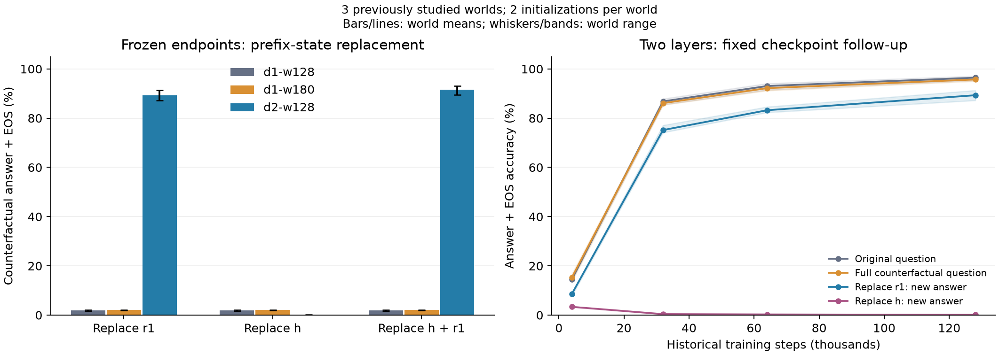

**复核与执行边界。** 原始逐例结果保存在results/grok-depth-bridge-v1，全部分母/子集/世界统计见[汇总](development-artifacts/grok-depth-bridge-v1/summary.json)、[逐状态表](development-artifacts/grok-depth-bridge-v1/state-results.csv)和[逐世界表](development-artifacts/grok-depth-bridge-v1/world-results.csv)。15项契约测试通过；[独立审计](development-artifacts/grok-depth-bridge-v1/audit.json)复算40状态与590个汇总组，另用历史原生Block前向在GPU5重载3状态、15,742条条件案例，答案/EOS全部一致，反事实logit差最大误差1.91×10⁻⁶。执行中发现TF32在不同序列长度下的数值差异；关闭TF32又改变了一个早期历史预测，因此最终保留历史精度并固定PAD形状，没有放宽阈值或更换样本。首轮源码记录发生并发元数据编辑与启动检查交叉，尝试源码差异、失败及重跑全部保留于[执行事件](development-artifacts/grok-depth-bridge-v1/execution-incident.json)、[数值修订](development-artifacts/grok-depth-bridge-v1/numerical-amendment-v3.json)和results下的attempts目录。最终40状态基线答案/EOS均与历史逐例一致；执行成本及产物见[完成清单](development-artifacts/grok-depth-bridge-v1/completion-manifest.json)。新证据涉及激活接口，不涉及共享参数编辑；下一机制问题需专门区分残差中的查询信息与中间实体信息，以及注意力和MLP各自的作用。

复现入口（拒绝覆盖已有批次）：

```bash
CUDA_VISIBLE_DEVICES=2 .venv/bin/python scripts/run_grok_depth_bridge.py --phase development
CUDA_VISIBLE_DEVICES=2 .venv/bin/python scripts/run_grok_depth_bridge.py --phase confirmation
.venv/bin/python scripts/report_grok_depth_bridge.py
CUDA_VISIBLE_DEVICES=5 .venv/bin/python scripts/audit_grok_depth_bridge.py --reload --device cuda:0
```

<a id="hebbian-interface"></a>
## 文献方法复用：固定读取器下的事实模块替换

直接复用[作者公开实现](https://github.com/HazyResearch/hebbian-mlps/tree/41443978d2261f30a9749fe7a286c95be08b331e)，把《MLPs are Hebbians》A.4.5的CE/完整向量MSE比较移入A.4.3的SSFR换映射任务。这是两条论文设置的受控组合，不是书籍语言实验“100%降至约90%”的数值复现，也不是新提出一种记忆方法。[文献与实现对应](development-artifacts/hebbian-interface-v1/literature-alignment.json)记录原文、配置差异与许可证。

1个开发世界后，不调配置地完成3个独立确认世界。每世界128事实、维64、带偏置SwiGLU宽256，单层单头模型74,944参数；MLP先用全批Adam训练10,000步并冻结，再仅训练读取器的Q/K共8,192参数4,000步。固定单位范数接口、V/O单位矩阵及词向量；无残差和位置编码。A/B共享词向量、使用不同随机事实排列，同一初始化分别拟合；CE/MSE配对初始化、样本流和预算。B从未用于读取器训练、提前停止或选checkpoint。开发任务与正式选择依据见[冻结计划](hebbian-learning-plan-v1.md#hebbian-interface)。

以下为3个确认世界的均值，除错误旧模块的全量结果外，各世界均相同；每世界全128键各8个独立干扰上下文，不把这些重复当作独立世界。

| 检验 | CE | MSE |
| --- | ---: | ---: |
| A/B模块精确键读出：事实词表及实际全词表 | 100% | 100% |
| 读取器调用原A模块，回答A事实 | 100% | 100% |
| 固定读取器，换入同目标B模块，回答B事实 | 100% | 100% |
| 固定读取器，换入另一目标B模块，回答B事实 | 100% | 100% |
| 保留错误A模块，回答B事实：全量 | 0.78% | 0.78% |
| 同一错误模块对照：实际改变映射的子集 | 0% | 0% |

错误模块全量各世界为1/128、2/128、0/128，成功项恰是映射未变的事实；改变子集共381/384个事实，覆盖99.22%。每个B评价条件共3,072次查询，其中改变子集3,048次。替换前后读取器参数不变，预测随新MLP映射改变，支持当前模块被实际调用；不据此证明事实只存于MLP或读取器完全不含事实信息。

CE的新B模块输出与目标向量平均夹角在三个世界为0.753–0.774弧度，仍成功接入；MSE相对向量误差约9.2–9.5×10⁻⁸。CE原始相对向量误差约27.6–28.9，其中尺度差会被后置归一化消除，因此不能单凭大范数误差解释调用失败。读取器送入MLP的相对键误差，CE为0.034–0.067、MSE为0.0061–0.0074，两者最终准确率均100%。**在这个低负载归一化设置中，明显偏离目标向量的CE记忆仍能被正确调用；未观察到CE/MSE准确率差距。** 满分不等于抗扰动能力相同，也未检验连续两跳、自然Qwen、严格保持编辑或GLM/Kimi。

开发与正式累计4世界、16个事实MLP和8个读取器，运行内部累计计时400.29秒，其中正式295.68秒；不含导入、开发检查和独立审计，不能当整项工作墙钟。正式读取器输入token共122,880,000，仅更新小型Q/K。8项关键测试通过；24个终点的CPU重载在预测、候选分数、准确率、配对、冻结及因果性上均通过，端点归一化分数误差小于10⁻⁶。严格审计仍保留5项MSE近零夹角复算差异，未放宽10⁻⁵阈值，也未改写原结果；`acos`在余弦接近1时放大float32舍入，故不精确解释该尺度的角度，见[数值说明](development-artifacts/hebbian-interface-v1/numerical-note.json)。这些不是主准确率差异。

证据：[逐世界结果](development-artifacts/hebbian-interface-v1/world-results.csv)、[完整汇总](development-artifacts/hebbian-interface-v1/summary.json)、[图](development-artifacts/hebbian-interface-v1/summary.png)、[正式源码与配置锁](development-artifacts/hebbian-interface-v1/confirmation-lock.json)、[完成与复核清单](development-artifacts/hebbian-interface-v1/completion-manifest.json)。后续已完成[两跳共享记忆的整体替换](#memory-reuse)；原先仅替换第一跳、固定第二跳的候选未执行，不与整体替换混同。

<a id="architecture-bridge"></a>
## 小模型架构扩展：Qwen3与Qwen3.5

本轮以小预算完成真实模型干预和受控架构训练，支持理论按模块及完整状态写出适用条件；没有验证GLM/Kimi，也没有建立自然模型中的选择性桥接修复机制。理论与条件性MoE扩展见[当前计划](hebbian-learning-plan-v1.md#architecture-bridge)。

**受控训练。** 2个新世界×2初始化×GQA/混合GatedDelta-GQA，共8条1024步轨迹、24端点；配对使用相同事实、样本流与可共享参数初始化。4层宽64，参数150,656/161,528，混合模型多7.22%，预算按步数和token相同，并非参数或FLOPs严格相同。完整答案含EOS的四运行均值如下。

| 架构 | 原子事实 | 训练组合 | 留出组合 | 外部两次调用 |
| --- | ---: | ---: | ---: | ---: |
| GQA | 99.80% | 99.51% | 12.89% | 99.61% |
| 混合GatedDelta/GQA | 100% | 100% | 13.28% | 100% |

原子事实和训练组合接近掌握，一次前向对留出组合仍明显不足；两次调用提供已知关系分解、使用模型生成的中间实体，增加调用与计算。仅2个独立世界，不能把四运行或256查询当独立世界，也不能将0.39个百分点差异解释成架构优势。两种小模型保留门控MLP、归一化和因果序列计算；混合模型不是Qwen3.5完整复刻。

固定干预子集每架构64次相关观察：GQA基线7正确，正确MLP/mixer/联合供体为8/12/15；混合基线6，分别7/31/29。联合错误供体为6/3，联合同范数随机方向为4/5。mixer替换能明显改变该子集的输出，但其供体看到完整两跳问题，18/32正确供体属于训练组合，可能已经携带答案信息，不能称为纯桥接修复。供体审计另发现1/32案例显式含正确答案，3/32含任一评分候选。冻结主统计保留；事后剔除后者，GQA联合14/58、混合mixer28/58及联合27/58，仍不消除完整供体携带答案的混淆。

训练有效token2,883,584，训练累计360.33秒，训练加评价累计374.87秒，失败0；行为评价21,504次、干预生成2,048次。源码/流/权重哈希和24端点审计通过，独立矩阵递推误差小于7×10⁻¹⁸，缓存续推小于7×10⁻¹⁶。证据：[汇总](development-artifacts/architecture-bridge-toy-v1/summary.json)、[审计](development-artifacts/architecture-bridge-toy-v1/audit.json)、[供体敏感性](development-artifacts/architecture-bridge-toy-v1/donor-purity-sensitivity.json)、[成本与完成清单](development-artifacts/architecture-bridge-toy-v1/completion-manifest.json)。

**真实模型干预。** Qwen3-0.6B-Base与Qwen3.5-0.8B-Base文本模型采用FP32，分别考察第6/14层的MLP输出和同层KV/递归缓存。每模型MQuAKE/2Wiki各4开发+24评价，共112个案例结果；没有三种等长桥前缀的8个案例保留排除，两模型共16条排除记录。96个有效模型-案例×2层×11条件，共2,112条干预生成。下面只列评价集，每个单元22例；基线提供错误桥，三个正确供体列分别替换MLP、状态、二者。另有无桥、完整正确桥、错误供体、随机和identity对照，全部保留。

| 模型 / 数据集 / 层 | 错误桥基线 | 正确MLP | 正确状态 | 正确联合 |
| --- | ---: | ---: | ---: | ---: |
| Qwen3 / MQuAKE / 6或14 | 0/22 | 0/22 | 0/22 | 0/22 |
| Qwen3 / 2Wiki / 6或14 | 1/22 | 1/22 | 1/22 | 1/22 |
| Qwen3.5 / MQuAKE / 6或14 | 2/22 | 2/22 | 2/22 | 2/22 |
| Qwen3.5 / 2Wiki / 6 | 6/22 | 7/22 | 7/22 | 7/22 |
| Qwen3.5 / 2Wiki / 14 | 6/22 | 6/22 | 7/22 | 7/22 |

Qwen3.5的2Wiki状态错误供体在两层也均为7/22，联合错误供体在第14层为7/22，第6层随机MLP为7/22。因而单题收益没有建立稳定选择性。随机缓存/联合干预在第14层降至0/22，但其方向可离开自然状态流形，不能把损坏直接解释成桥接必要性。没有桥提示时，两模型MQuAKE为1/24、4/24，2Wiki为4/24、11/24；完整正确桥输入在有效子集分别为1/22、5/22与1/22、12/22。特别是Qwen3的正确桥提示表现也弱，本设计对该模型的机制检验能力有限；不以内部patch失败推断普遍不可组合。两个家族的规模、预训练和提示适配不同，分数差不是架构因果效应。

**有限局部学习。** 每模型4个独立目标，从原始权重重启，仅更新第14层down矩阵8步；E为有support上下文的第一跳答案，D为未参与监督的两跳问题，R为4个回放第一跳问题，U为8个未用于更新的问题。E/D各4条，R/U跨episode复用，不能把重复评价当独立事实。

| 模型 | E完整答案，0→8步 | D完整答案，0→8步 | R / U完整答案，0→8步 | 终点R / U首token KL |
| --- | --- | --- | --- | --- |
| Qwen3 | 1/4→2/4 | 0/4→0/4 | 0% / 37.5%，均不变 | 0.00161 / 0.00145 |
| Qwen3.5 | 3/4→3/4 | 2/4→2/4 | 75% / 75%，均不变 | 0.01497 / 0.02772 |

八个目标的训练交叉熵均下降，但没有观察到D完整答案改善。[逐例复核](development-artifacts/architecture-bridge-v1/learning-format-review.json)发现，Qwen3唯一E的EM提升由“完整句子包含Constantin J. David”变成仅输出名字，是格式改善，不能当新增事实学会。R/U的EM不变也不等于分布严格保持；R的KL回放只覆盖首个答案token，D虽然未监督，其相关证据可能已在E的support中出现。这轮验证了混合架构局部更新和分通道评价可执行，未证明长期学习或知识传播规律。

自然模型主结果记录内累计计时Qwen3为722.90秒、Qwen3.5为618.92秒；封存重复计算另为106.66/0.90秒，失败尝试的未记录时间不补估。它们不是端到端墙钟。112案例、8学习端点、2,112干预行完整性审计无失败；全部对照、分组区间和0/1/4/8节点见[机器可读汇总](development-artifacts/architecture-bridge-v1/summary.json)、[汇总图](development-artifacts/architecture-bridge-v1/summary.png)、[完整性审计](development-artifacts/architecture-bridge-v1/audit.json)、[成本清单](development-artifacts/architecture-bridge-v1/completion-manifest.json)。

本轮54项相关契约测试、15个Python文件静态检查通过。自然模型4,924项完整性检查无失败；[独立GPU重载](development-artifacts/architecture-bridge-v1/endpoint-audit.json)1,006项检查全部通过，复现两模型固定开发例的44条干预及8个学习端点E/D。生成token精确一致，缓存/完整前向评分最大差3.815×10⁻⁶，低于预定10⁻⁴；原down哈希恢复通过。该重载没有遍历所有自然语言案例，也不代表已完成全部数据标注的语义审查。

**参数结构与数学边界。** 四个受测down矩阵在相对阈值10⁻⁶和10⁻⁵下均满行秩1024。因此`Δh∈col(B)`在这些层不限制输出维数，不能用秩亏反例解释自然模型。60项CPU float64代数校验通过，最大恒等式误差4.27×10⁻¹⁵，支持固定router的MoE拼接、真实递归顺序及包含旁路的非线性展开；这是数值核验，不是长期学习速度或GLM/Kimi实证。证据：[参数谱](development-artifacts/architecture-bridge-v1/parameter-structure.json)、[代数检查](development-artifacts/architecture-bridge-v1/algebra-checks.json)。

**工程修订与证据边界。** 原始案例、预算、模型revision与评分规则保持冻结。transformers 5.17对Qwen3.5重建分词正则导致2个案例输入变化，现改为直接读取官方tokenizer.json；每模型708个文本组件与原准备环境逐token ID核验一致。已完成的1个受影响排除案例封存后重跑，另1个失败案例继续完成。Qwen3局部学习曾将提示与后缀联合分词，而生成分开分词；已统一，并封存重跑原定4个学习episode。两个修订均保留旧源码、锁、输出与成本，不按结果换样本。证据：[分词修订](development-artifacts/architecture-bridge-v1/tokenizer-amendment.json)、[逐ID审计](development-artifacts/architecture-bridge-v1/tokenizer-consistency-audit.json)、[学习分段修订](development-artifacts/architecture-bridge-v1/learning-boundary-amendment.json)。

本批复用了历史自然语言案例，属于探索；2Wiki含gold-support上下文，显式桥与供体也是额外帮助。固定生成上限32token，规范化完整短答案EM、别名、F1和完整候选含EOS分数分别保留；案例分组bootstrap区间不作多重校正。冻结设计与原始结果入口：[契约](development-artifacts/architecture-bridge-v1/preregistration.md)、[配置](../configs/architecture-bridge-v1.json)、[逐例结果](../results/architecture-bridge-v1/)。

<a id="bios"></a>
<a id="bios-original"></a>
## 原版bioS开发状态

**两个10k开发世界的CPU复盘、18端点抽样重载与调用诊断已完成。** 六个预训练各540次人物曝光，六个QA适配、十二个任务分支。独立复算570万条原始预测的真值、提示、格式、冻结评分与2280个统计单元，全部与历史结果一致；六条预训练的3240条曝光日志完整。下表为两个世界等权准确率，保留五种未见问法与人物内重复测量，不能当成独立人物或世界。

| 预训练条件 | 规范六属性QA | 五个留出问法均值 |
| --- | ---: | ---: |
| S：固定传记 | 5.07% | 0.57% |
| M：五种表达 | 35.65% | 14.06% |
| MP：相同五种表达＋句序变化 | 99.96% | 32.90% |

各条件语义事实曝光相同，文本token与难度仍不同。所有人物参加BIO，只有QA训练人物参与适配；这里是经相同QA适配后的测试人物提取，不能称未经适配的预训练问答。工作城市已直接出现于传记，属于提取。

任务适配后，MP规范问法的完整日期/年份/月份奇偶/出生早晚比较为94.16%/34.10%/75.02%/0%。同一个MP-CoT端点直接回答的年份/奇偶为39.01%/60.00%，允许CoT时为84.06%/99.39%，比较仍0%。CoT改变提示与生成计算；其历史短答案log概率不是推理链最终答案概率。MP-R与随机竞争控制须并列，不能把所有收益归因于指定关系约束。详见[完整CPU报告](development-artifacts/bios-original-review-v1/report.md)及[定性审阅](development-artifacts/bios-original-review-v1/semantic-review.md)。

**冻结评分与语义/格式分别报告。** MP直接比较输出99.99%、MP-CoT的CoT比较输出100%未精确返回题中任一人名。另一方面，MP-CoT直接作答的留出日期问法中，25.89%的全量输出虽然未通过原评分，末个`Answer:`后恰为正确日期；该事后辅助统计不替代历史主分数。条件分析保留源日期答对的人物/人物对及覆盖，不能代替真实自主调用。

**新增重载与规则诊断。** 18端点各重放预先选定的原物理batch，共1584条，生成、EOS、评分与log概率全部一致，最大log概率差为0。另在每世界24固定开发人物、规范及一个留出问法上完成576条日期提取和4608条诊断。MP规范月份奇偶直接37/48，自主提取再调用原规则48/48，真实月份输入48/48；完整日期正确41/48，月份正确47/48，因此任务答对不代表每次都提取了正确属性。留出问法的自主原始成功43/48，可解析输入且最终正确42/48，均与覆盖另报。

全部六种任务条件在给定真实日期的新日期对上，比较规则正确率均0/48，输出也不属于给出的两个日期。事后独立补测12个任务端点的原36条规则，月份12/12、日期24/24全部正确。该设置的比较规则未迁移到新日期对，不能将原比较失败归因为纯知识提取/组合接口，更不能推断架构上限。完整生成、各世界与条件、不可解析输入和主机计算参照见[诊断汇总](development-artifacts/bios-original-diagnostics-v1/summary.json)及[补测登记](development-artifacts/bios-original-diagnostics-v1/rule-replay-followup.md)。主机计算不是模型成绩；反向问序属于重复测量。

**预训练中的原生续写曲线已完成。** 六条既有预训练的0/30/90/180/360/540曝光权重共36个，固定案例续写2304条，未新增训练。每世界32位固定开发人物各测日期与出生地；下表在相同人物上配对预训练540曝光端点的BIO续写与之后QA适配端点的规范问答，两个世界等权。

| 条件 | 日期原生续写 | 日期QA | 出生地原生续写 | 出生地QA |
| --- | ---: | ---: | ---: | ---: |
| S | 100.00% | 14.06% | 100.00% | 1.56% |
| M | 98.44% | 89.06% | 100.00% | 64.06% |
| MP | 95.31% | 100.00% | 100.00% | 100.00% |

S在预训练阶段已经学会这些原生属性续写，但未充分转化为后续QA表现。两列来自不同训练阶段的权重和不同输入，尚未排除适配后的保持变化；出生地续写前缀还包含真实完整日期。因此不能声称同一权重下全部知识已具备而只有调用接口失败。S/M前缀对应已见措辞和顺序，MP具体连续顺序曝光未重构；不同表达的复现次数也不同，不以这条曲线比较抽象的知识量或推理形成速度。

评分要求立即生成完整属性的全部token，保留后缀首token边界评分与逐例概率。终点严格失分共4例，其中3例MP在正确日期前增加短语；不改写主分数，也不将这些失分全部解释为事实遗忘。[完整形成曲线](development-artifacts/bios-original-trajectory-v1/native-attribute-curves.png)、[报告与复现](development-artifacts/bios-original-trajectory-v1/report.md)、[独立复核](development-artifacts/bios-original-trajectory-v1/audit.json)保留全部节点、分母和匹配QA。100k主矩阵及日期更新尚未执行。原配置与执行状态：[配置](../configs/bios-original-development-v1.json)、[历史状态快照](bios-development-status.json)、[当前计划](hebbian-learning-plan-v1.md#bios)。

<a id="frozen-twohop"></a>
## 冻结真实模型两跳

Qwen3-0.6B-Base与4B-Instruct均未更新权重；MQuAKE闭卷、2Wiki全部上下文各128评价案例。4B的规范化完整答案EM如下，评分包含冻结的答案抽取规则，不是整段生成及EOS逐token匹配。

| 方法 | MQuAKE | 2Wiki | 信息与预算 |
| --- | ---: | ---: | --- |
| 直接 | 23.44% | 28.13% | 32输出token |
| 自主桥接 | 25.78% | 32.81% | 32+32token，两次调用 |
| 数据集分解串联 | 36.72% | 35.16% | 额外提供问题分解，使用模型实际桥接答案 |
| 真实桥接 | 33.59% | 32.81% | Oracle |
| 短CoT | 17.97% | 22.66% | 64token，格式/预算失败另列 |
| 长CoT | 36.72% | 36.72% | 补充256token对照，计算增加 |

自主桥接配对差为+2.34/+4.69个百分点，95% bootstrap区间分别为[−1.56,+7.03]/[−0.78,+10.16]；长CoT为+13.28/+8.59，区间[+6.25,+20.31]/[+0.78,+17.19]，均未做多重校正。2Wiki两单跳都通过的37例中长CoT为81.08%，该子集仅覆盖28.91%，不作全量分数。

FP32全评价复核中，保留MLP有限特征变化的响应预测比输入梯度准确，4B在两数据集的MAE相对减少约46.8%/41.3%；该离线诊断使用标签及局部响应，不能当作自然错误预测器。隐藏修复收益小，随机、错误桥接及反方向也有收益，尚无稳定的桥接特异机制证据。

11,128条生成；4项契约测试、4036项主审计及2888项FP32审计通过。模型大小、指令训练与提示不同，不能作纯规模因果比较；数据别名碰撞、语义冲突和评分粒度仍限制解释。详见[完整报告与复现](twohop-frozen-results-v1.md)、[审计](development-artifacts/twohop-frozen-v1/completion-audit.json)、[FP32审计](development-artifacts/twohop-frozen-v1/full-precision-audit.json)。

<a id="twohop-module"></a>
## Hebbian模块与两跳深度

| 批次 | 完成范围 | 核心结果 | 边界与证据 |
| --- | --- | --- | --- |
| Hebbian E1模块 | MQuAKE原始事实图962原子、598去重链；4宽度×3种子=12配置；只拟合原子事实 | 宽512单跳98.61%、连续两跳68.67%；宽1024二者100% | 人工实体向量及显式接口，不是自然语言MQuAKE成绩；[逐配置结果](development-artifacts/twohop-hebbian-v1/module-results.csv)、[审计](development-artifacts/twohop-hebbian-v1/completion-audit.json) |
| 两跳深度 | 28训练、196节点、279,552次逐例干预；2世界×2初始化，7架构 | 4096步时所有模型单跳/训练组合/外部自主两次调用100%，留出两跳架构均值0.88%–3.34% | 小型符号任务；[主审计](development-artifacts/twohop-depth-v1/audit.json)、[完整表与复现](development-artifacts/twohop-depth-v1/README.md) |

E1中宽512两原子均解码正确的链，连续两跳仍为69.38%。范数充分界在宽128/256/512的认证覆盖均为0，宽1024为100%；错误认证为0，但中等误差区间缺少覆盖。双线性精确展开残差最大5.09×10⁻¹⁵；36数值检查、3契约测试和386项审计通过，12模型/24预测重载。三种子共用事实图，不能当独立事实样本。

深度实验中，同宽6层比1层主预算平均高1.95个百分点；相对近等参数2层仅高0.71，部分配对方向相反。8192步浅宽模型出现回退，CPU FP32评价仍存在；恒定学习率未为各架构调优。第5层桥接实体可100%读出，也未带来可靠的反事实组合使用；donor对应训练内问题的高成功率与留出泛化分别报告。8契约测试、799哈希、28终点重载及196节点干预等价性检查通过。

相关配置：[模块](../configs/twohop-hebbian-v1.json)、[深度](../configs/twohop-depth-v1.json)。数学命题与未启动的E2/E3扩展见[当前计划](hebbian-learning-plan-v1.md#twohop-theory)。

<a id="hebbian"></a>
## Hebbian启发学习与Future Work

| 批次 | 完成范围 | 结论 | 证据入口 |
| --- | --- | --- | --- |
| Hebbian学习v1 | 24数学校准、127训练运行；其中9正式形成模型、72后续学习轨迹 | C1相对C0/C2的后续学习收益未获支持；C1−C0的Q-AUC约−0.0005，区间跨零 | [执行状态](development-artifacts/hebbian-learning-v1/resume-execution-status.json)、[实施修订](development-artifacts/hebbian-learning-v1/execution-amendments.md) |
| Future Work v1 | Qwen768事实×4问法，24符号训练、72复习轨迹、240抗扰动节点 | 后层核改善跨表达失败预测；共同冲突人群的相关性效应在2/4层配置方向不同；复习未稳定修复组合 | [产物目录](development-artifacts/hebbian-future-v1/)；9测试、289完整性检查、96终点重载 |
| Future Work v2 | 512新主体、2048生成、8192完整候选评分；108训练、540节点 | 完整答案下核增益缩小，L27 MLP保留小正向信号；固定竞争事实与近等参数控制未稳定复现首轮方向反转；基础事实及自主两次调用均100%，直接组合仍有缺口 | [产物目录](development-artifacts/hebbian-future-v2/)；10测试、469完整性检查、108终点重载 |

C0/C1/C2都使用同一SwiGLU与梯度优化，比较的是训练目标，不能写成“Hebbian与普通MLP”的对比。自由生成未识别、候选竞争与真实知识错误分开；完整候选评分并不等于自由生成。首轮深度与参数量共同改变，第二轮保留了对该解释的修正。以上均未按显著性、效应或掌握率淘汰条件。

<a id="qwen"></a>
## Qwen局部约束与路径学习

| 批次 | 完成范围 | 主要发现 | 边界 |
| --- | --- | --- | --- |
| 约束诊断v2.19 | 原始Qwen3-0.6B；3744有限扰动、288零更新校准；12目标、64保持、64未约束事实和16自然文本片段 | 第14层qa的局部参数代价相对无约束为功能保护1.20倍、全位置表示保护4.29倍；末位置特征保护仍有最终输出漂移 | 4个已测层down满行秩；未证明门控或长期学习瓶颈；[产物](development-artifacts/qwen-constraints-v1/) |
| 路径学习v2.20 | 24条256步开发轨迹、168评价节点、24位置诊断节点 | 128步4单元×4类位置恢复的16/16条件均增大R分布漂移；无候选达到当时预定推进判据 | 按原规则停止，96确认轨迹未启动，U/自然文本测试集没有更新后评价；[产物](development-artifacts/qwen-path-learning-v1/) |

路径开发中完整更新R KL为0.00691–0.01138；恢复实体末位置使KL增大约4.8%–20.1%，查询内容为23.6%–297.3%。这与不同位置共同维持回放行为相容，尚未证明具体抵消机制。严格答案下降主要涉及格式/名称变体，未作为等量遗忘报告。后续[跨时间复盘](development-artifacts/path-learning-reassessment-20260929/)属于事后探索，不改写原停止决定。

<a id="organization"></a>
## 组织、关系与编辑历史批次

以下是不同契约的实验，计数有复用，不能逐行相加成独立模型总数。E/D/U分别为直接修改、必要传播与未参与选择的保持；早期E93/D96和确认批次共同E39不可直接比较编辑效率。

| 批次 | 已完成 | 主要发现与保留限制 | 证据 |
| --- | --- | --- | --- |
| v2.3 SA/AS顺序 | 8学习、256个512步编辑；24 GPU阶段/终点及8 CPU终点诊断 | 例外更新主要受默认/个人城市传播混淆及局部保持损伤限制；课程效应依赖方法；9月25日的4/8中断状态已被补跑取代 | [本地完整产物](../results/bios-dev-v1/)、[配置](../configs/bios-symbolic-development-v1.json) |
| v2.4 A/B/C文档组织 | 12学习、96编辑、12终点诊断 | 首次观测99%达标平均步数A/B=6272、C=9856；直接修改96/96成功，例外更新联合成功0/48；编辑组织优势随参数范围反转 | [报告](development-artifacts/organization-v1/report.md)、[完成清单](../configs/bios-organization-completion-20260926.json) |
| v2.5容量与QA留出 | 42容量诊断、24个50% QA留出轨迹；594节点 | 小模型增加预算仍改善，低分不证明容量上限 | [配置](../configs/bios-capacity-development-v1.json)、[本地产物](../results/bios-capacity-dev-v1/) |
| v2.6关系交叉 | 12学习、96编辑；72学习/384编辑节点 | 组合QA终点匹配效应+0.842个百分点，四块同向；编辑传播未继承正平均匹配收益 | [报告](development-artifacts/cross-v1/report.md) |
| v2.7全规模交叉 | 宽64/128/256/768，共48学习、384编辑、1824节点 | 约221.8万参数档的不匹配任务平均获益22.45个百分点；规模改变例外损伤，不能由最大档外推 | [报告](development-artifacts/cross-scale-v1/report.md) |
| v2.8机制开发 | 复用48模型/384编辑，新增60学习/续训、480编辑；528状态两步调用 | 自主两步显著改善部分组合，监督与上下文只修复部分传播；内部候选未建立选择性必要性与恢复证据 | [审计](development-artifacts/mechanism-v1/development-completion-audit.json)、[计分勘误](development-artifacts/mechanism-v1/ERRATA.md) |
| v2.9独立世界确认 | 8新世界、96学习、768共同E39编辑 | 主要例外编辑增益未确认；学习改善及一致更新代价得到预定校正确认 | [前瞻设计](development-artifacts/shortcut-confirmation-v1/preregistration/preregistration.md)、[统计报告](development-artifacts/shortcut-confirmation-v1/statistics/report.md) |
| v2.11上下文梯度 | 4共同中性短轨迹，0/32/128步72测量臂 | 方向余弦0.295/0.417/0.371，高于打乱约0.003–0.005；相对向量误差均>1，不能代替真实梯度 | [报告](development-artifacts/context-gradient-v1/report.md) |
| v2.12监督配比与均匀注意力 | 新增120编辑、复用72；36均匀注意力臂及1数值控制 | 平均冲突传播改善，组织匹配劣势却扩大；第一层真实/均匀梯度余弦约0.998，统计近似仍失准 | [报告](development-artifacts/followup-v1/report.md) |
| v2.13路径与最小模型 | 12既有状态、5184单步条件；2预训练、48多步编辑、72 Jacobian校准 | 成熟冲突更新24/24削弱正确相对冲突答案优势，其中23/24正确概率仍增加；相似特征和同向误差也可有反向参数梯度 | [路径报告](development-artifacts/path-transfer-v1/report.md)、[最小模型报告](development-artifacts/path-minimal-v1/report.md) |
| v2.15目标充分与独立世界 | 112训练、2736主编辑、768调参编辑 | 补齐目标后原微型模型普通联合微调6/6独立成功；8新世界GN的严格联合成功约35%，Adam23.44%，成本与曲率近似敏感性另计 | [方向产物](development-artifacts/direction-v1/)、[汇总产物](development-artifacts/direction-report-v1/) |
| v2.16四格关系响应 | 24人物×4格，新增48/复用48编辑，各1024步；672小步校准 | 一致/冲突组合40/48与5/48；直接、归属、自主两步均96/96；编辑前22/24、四格主效应23/24为个人事实响应更强 | [产物](development-artifacts/relation-response-v1/) |

v2.9的三项确认终点必须一起报告：原例外学习39.31%→73.76%；一致更新同人传播87.73%→64.58%；新例外固定9人传播12.62%→15.10%，差+2.49个百分点，同时区间[−2.17,+7.15]、Holm p=0.139。全D及U代价保留，不能概括为普遍提高可编辑性。设计在新世界生成前封存，未通过追加世界或重选终点改变结果。

v2.12四档监督权重的冲突传播16.02%/18.07%/20.58%/23.87%，组织匹配差从−7.40扩大至−16.44个百分点。v2.13最小模型原长期0/6失败没有给足另一关系的新目标，不能作为架构不可分离的证据；v2.15补齐目标后的6/6成功是对此的实质修正。v2.16确认错误功能依赖，但未定位唯一组件或验证训练形成原因。

v2.10与v2.14是研究复盘/文献修订，没有新增训练，现有方向已并入[当前计划](hebbian-learning-plan-v1.md)。历史Qwen1.7B、SmolLM2、RippleEdits候选不代表已完成跨家族或外部验证。

<a id="reproduction"></a>
## 复现入口与证据优先级

1. 当前结论与状态看本汇总；精确数字、分母和预定比较看批次CSV/JSON及冻结报告；原始逐例预测与权重位于本地 `results/`。
2. 已完成批次的实际实现以 `development-artifacts/` 中源码快照、锁和环境为准；工作区代码可能晚于执行版本。
3. 历史协议全文见[执行快照](development-artifacts/qwen-path-learning-v1/execution-source/docs/experimental-protocol.md)，各批完整操作说明见上方证据链接；部分报告脚本会覆盖输出或重新生成已合并文档，运行前核对目录与锁。

| 批次 | 主要入口/配置 |
| --- | --- |
| 固定调用后替换知识 | [冻结与训练](../scripts/run_memory_reuse.py)、[独立计分与重载](../scripts/audit_memory_reuse.py)、[汇总与作图](../scripts/report_memory_reuse.py)；[正式配置](../configs/memory-reuse-confirmation-v1.json)、[正式训练锁](development-artifacts/memory-reuse-v1/confirmation/lock.json)、[完成清单](development-artifacts/memory-reuse-v1/completion-manifest.json) |
| 组合练习结构 | [冻结/队列/训练](../scripts/run_text_structure.py)、[同精度评分与重载](../scripts/verify_text_structure.py)、[全目标与支持分组](../scripts/analyze_text_structure.py)；[开发配置](../configs/text-structure-development-v1.json)、[正式配置](../configs/text-structure-confirmation-v1.json)、[正式训练锁](development-artifacts/text-structure-v1/confirmation/lock.json)、[完成清单](development-artifacts/text-structure-v1/completion-manifest.json) |
| 损失来源与参数变化 | [队列](../scripts/execute_text_loss_source.py)、[独立评分及重载](../scripts/report_text_loss_source.py)、[参数互换](../scripts/analyze_text_loss_weights.py)、[完成核验](../scripts/finalize_text_loss_source.py)；[后续配置](../configs/text-loss-source-followup-v1.json)、[训练源码锁](development-artifacts/text-loss-source-v1/followup/lock.json)、[参数执行锁](development-artifacts/text-loss-source-v1/weight-analysis-execution-lock.json) |
| 文本预训练归因 | [训练队列](../scripts/execute_text_pretrain.py)、[首跳干预](../scripts/analyze_text_pretrain.py)、[重载审计](../scripts/audit_text_pretrain.py)、[汇总](../scripts/report_text_pretrain.py)、[完成核验](../scripts/finalize_text_pretrain.py)；[确认配置](../configs/text-pretrain-confirmation-v1.json)、[训练源码锁](development-artifacts/text-pretrain-v1/confirmation/lock.json)与[干预锁](development-artifacts/text-pretrain-v1/confirmation/analysis-lock.json) |
| bioS同权重诊断 | [冻结与运行](../scripts/run_bios_same_weight.py)、[独立复算及主体参数核验](../scripts/report_bios_same_weight.py)；[来源锁](development-artifacts/bios-same-weight-v1/lock.json) |
| 循环终点监督 | [冻结/训练/审计](../scripts/run_grok_loop_supervision.py)、[队列](../scripts/execute_grok_loop_supervision.py)、[汇总](../scripts/report_grok_loop_supervision.py)、[动力学](../scripts/analyze_grok_loop_supervision_dynamics.py)、[完成核验](../scripts/complete_grok_loop_supervision.py)；[后续配置](../configs/grok-loop-supervision-followup-v1.json)与[源码锁](development-artifacts/grok-loop-supervision-v1/followup-lock.json) |
| 事实组合使用经历 | [训练队列](../scripts/execute_grok_usage.py)、[汇总](../scripts/report_grok_usage.py)、[自主调用审计](../scripts/audit_grok_usage_calls.py)；[确认配置](../configs/grok-usage-confirmation-v1.json)与[源码锁](development-artifacts/grok-usage-v1/confirmation-lock.json) |
| Loop Transformer | [后处理恢复](../scripts/postprocess_grok_loop.py)、[主汇总](../scripts/report_grok_loop.py)、[机制及循环扫描汇总](../scripts/report_grok_loop_mechanism.py)、[原子分组探索汇总](../scripts/report_grok_loop_atomic_timing.py)、[完成核验](../scripts/finalize_grok_loop.py)；[正式配置](../configs/grok-loop-confirmation-v1.json)与[源码锁](development-artifacts/grok-loop-v1/confirmation-lock.json) |
| Loop连续评分与同桥供体 | [连续评分](../scripts/report_grok_loop_continuous.py)、[供体冻结/执行](../scripts/analyze_grok_loop_same_bridge.py)、[供体汇总](../scripts/report_grok_loop_same_bridge.py)、[独立复核](../scripts/audit_grok_loop_same_bridge.py)；[配置](../configs/grok-loop-same-bridge-v1.json)与[后续源码锁](development-artifacts/grok-loop-same-bridge-v1/confirmation-lock.json) |
| 小模型架构扩展 | [真实模型运行](../scripts/run_architecture_bridge.py)、[汇总](../scripts/report_architecture_bridge.py)、[独立端点审计](../scripts/audit_architecture_bridge_endpoints.py)、[受控模型](../scripts/run_architecture_bridge_toy.py)；自然模型须使用[冻结5.17环境](development-artifacts/architecture-bridge-v1/environment-provenance.json) |
| 冻结两跳 | [完整复现顺序](twohop-frozen-results-v1.md)；[twohop-frozen-v1.json](../configs/twohop-frozen-v1.json) |
| Hebbian模块 | [准备](../scripts/prepare_twohop_hebbian_benchmarks.py)、[数值检查](../scripts/check_twohop_hebbian_theory.py)、[运行](../scripts/run_twohop_hebbian_module.py)、[审计](../scripts/audit_twohop_hebbian_module.py) |
| 深度 | [运行](../scripts/run_twohop_depth.py)、[配置](../configs/twohop-depth-v1.json)、[产物说明](development-artifacts/twohop-depth-v1/README.md) |
| 原版bioS | [当前契约及命令](hebbian-learning-plan-v1.md#reproduction) |
| Future Work v1/v2 | [执行入口](../scripts/execute_hebbian_future.py)、[v1配置](../configs/hebbian-future-v1.json)、[v2配置](../configs/hebbian-future-v2.json) |
| Qwen约束/路径 | [约束入口](../scripts/run_qwen_constraints.py)、[路径入口](../scripts/execute_qwen_path_learning.py) |
| A/B/C组织 | [准备](../scripts/prepare_bios_organization.py)、[运行](../scripts/run_bios_organization.py)、[汇总](../scripts/summarize_bios_organization.py) |

组合结构批次的已完成训练可只读式重审并重新生成汇总：`CUDA_VISIBLE_DEVICES=2 .venv/bin/python scripts/verify_text_structure.py --config configs/text-structure-confirmation-v1.json`。入口显式使用与原训练一致的FP32/TF32设置；大体积原始表、全部预测及权重位于`results/text-structure-v1/`。重新训练须使用独立输出目录和对应新锁，不能覆盖历史产物。

这些入口用于定位实现；新批次按[实验协议](experimental-protocol.md)封存独立契约。
