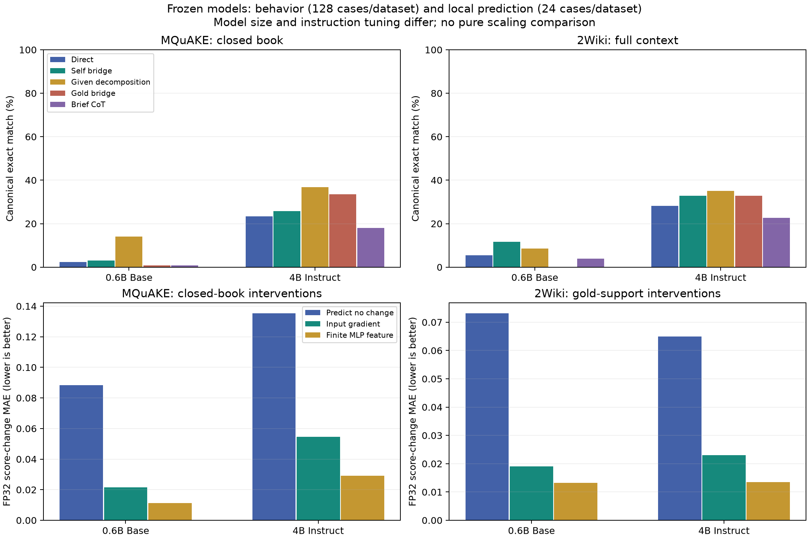

# 冻结真实模型的两跳行为与MLP干预

2026-09-29。原计划见[§14.29.12–13](hebbian-learning-plan-v1.md#142913-冻结模型首轮执行契约2026-09-29模型评价前)。本轮没有训练模型、适配器、分类器或探针。使用Qwen3-0.6B-Base和Qwen3-4B-Instruct-2507，两主运行开始和结束的参数内容SHA256完全一致。两者规模、指令训练和提示形式不同，不能作纯规模因果比较。

**全部运行及复核已完成。** 保存11,128条成功批次的生成响应，包含行为、干预、长CoT及重复精度验证；另有12,528条干预候选评分、1,392条梯度参考候选评分。4项契约测试、主批4036项及全评价FP32的2888项审计均通过。没有把重复干预当作独立案例，也没有用重复运行改写原BF16结果。



图上排为原定短预算的点估计，较长CoT另列下表；下排使用全部固定评价干预的FP32结果。配对区间见CSV，不把两个检查点当作独立规模实验。

## 现成模型可以改善组合表现，但内部接口解释尚未确认

4B模型在MQuAKE和2Wiki各128个固定评价案例上的结果如下。主评分为规范化完整答案EM；它是固定子集的标签一致率，不是全量排行榜分数，也不自动代表语义正确性。

评分先按固定规则抽取首行；存在`Final answer:`时取最后一个标记后的首行，再作规范化。此处EM不等于整段生成及EOS的逐token完全一致。

| 方法 | MQuAKE闭卷 | 2Wiki全部上下文 | 信息和预算 |
|---|---:|---:|---|
| 直接回答 | 23.44% | 28.13% | 最多32输出token |
| 自主提出桥接，再答原题 | 25.78% | 32.81% | 不给真实桥接，最多32+32token、两次调用 |
| 数据集给问题分解，再串联回答 | 36.72% | 35.16% | 第二跳使用模型第一跳实际答案；分解是额外帮助 |
| 给真实桥接，再答原题 | 33.59% | 32.81% | Oracle诊断 |
| 短CoT | 17.97% | 22.66% | 最多64token，格式/预算失败另列 |
| 较长CoT，补充对照 | 36.72% | 36.72% | 同一批题、相同提示，增加至256token |

自主桥接相对直接回答的提升为+2.34和+4.69个百分点，案例配对bootstrap 95%区间分别为[−1.56,+7.03]和[−0.78,+10.16]，当前小幅收益仍有不确定性。较长CoT提升+13.28和+8.59个百分点，区间为[+6.25,+20.31]和[+0.78,+17.19]；它增加了计算，不能称同预算优于原方法。区间未作多重比较校正，也不涵盖模型选择与预训练来源的不确定性。

短CoT在MQuAKE有80/128例没有`Final answer:`标记；因此另运行全部256评价案例的256token对照，保留原64token结果。较长CoT分别122/128、127/128例有标记。主模型两数据集的长CoT来源别名EM恰好均为46.88%；标准EM均为36.72%也是实际计数47/128，不是重复填表。未把所有格式或别名失分判为知识错误。

0.6B对照的直接/自主桥接/数据集分解EM分别为MQuAKE 2.34/3.13/14.06%，2Wiki 5.47/11.72/8.59%。该Base模型的指令跟随、知识覆盖和评分格式均有限，不能用其低分否定理论。全部开发/评价条件、F1与别名评分见[行为表](development-artifacts/twohop-frozen-v1/behavior-summary.csv)。

## 单跳通过的条件子集

| 4B模型 | 两单跳均通过/全量 | 直接组合 | 自主桥接 | 较长CoT |
|---|---:|---:|---:|---:|
| MQuAKE | 30/128，覆盖23.44% | 16/30，53.33% | 16/30，53.33% | 22/30，73.33% |
| 2Wiki | 37/128，覆盖28.91% | 21/37，56.76% | 27/37，72.97% | 30/37，81.08% |

这给出冻结评分下“单跳通过、直接组合未通过”的14个和16个候选案例。81.08%仅适用于37例条件子集，不能当作全量准确率。数据集分解串联在这些子集上均100%，与先验条件及复用同一单跳问题相符，是信息与执行对照，不是自主发现推理链的证据。来源语义冲突和答案粒度仍需审核，不能将所有差额都认定为接口失败。

## 局部干预及方向预测

每模型固定64机制案例，其中4个MQuAKE开发案例没有满足条件的错误供体，保留缺失记录；60有效案例×3层×9条件=1620次干预生成。评价部分每数据集24例，所有层和条件都报告。只改生成前最后提示位置的一个MLP输入，随后解码不重复添加扰动。2Wiki机制阶段给gold-support段落，属于检索已解决的诊断，不能混作全部上下文成绩。第一跳、第二跳及错误桥接供体的状态并不天然等于真实计算接口。

比较普通输入梯度预测与保留真实SwiGLU有限特征变化的预测：

\[
p_x=\nabla_x g^T\Delta x,\qquad
p_\phi=\nabla_\phi g^T[\phi(x+\Delta x)-\phi(x)].
\]

g是正确标签与固定错误后继两个完整答案的平均token对数概率差。梯度使用标签，只能作为离线干预响应诊断；不是无需真值的推理方法。特征预测保留了MLP非线性，后续网络仍作一阶近似，不是双线性恒等式在完整Transformer上的证明。

BF16主矩阵中，4B的输入/特征预测MAE为MQuAKE 0.08317/0.06208、2Wiki 0.06487/0.05561。不过4B 2Wiki的两候选与18候选批量计算存在最大1.00074的零干预分数差，超过典型干预变化，故不能只凭这些小幅预测增益作机制结论。先完成每模型每数据集4例FP32复核，再扩展到所有24例评价案例、所有三层和九条件；原BF16结果保持不变。FP32完整结果与行为对照另见[全量精度汇总](development-artifacts/twohop-frozen-v1/full-precision-summary.json)。

在BF16初始结果中，4B自主桥接隐藏干预对MQuAKE三层均没有净EM提升，2Wiki中后层各净救回1/24例；随机、错误桥接或反方向也可救回案例。给真实第二跳状态的后层干预有少量收益及损伤。说明“某次patch有效”尚未隔离出正确桥接特有机制；固定单位置的零效应也不排除其他位置、注意力、残差或多层协作。全量FP32复核后的具体结论在完成记录中单列。

**全量FP32完成结果。** 每格24案例，每案例3层×8非零干预，共576个相关测量；误差越低越好。

| 模型/数据 | 不变预测MAE | 输入梯度MAE | 特征预测MAE | 特征相对输入的误差减少，案例bootstrap 95%区间 |
|---|---:|---:|---:|---:|
| 0.6B / MQuAKE | 0.08825 | 0.02154 | 0.01131 | 0.01023 [0.00751,0.01329] |
| 0.6B / 2Wiki | 0.07317 | 0.01903 | 0.01325 | 0.00579 [0.00284,0.00988] |
| 4B / MQuAKE | 0.13537 | 0.05464 | 0.02906 | 0.02558 [0.01508,0.03765] |
| 4B / 2Wiki | 0.06498 | 0.02300 | 0.01349 | 0.00951 [0.00310,0.01813] |

4B误差相对下降约46.8%/41.3%，最大批大小分数漂移降至1.88×10⁻⁵/1.07×10⁻⁴。支持“保留MLP有限非线性有助于预测这些局部响应”；仍不是自然失败预测器或Hebbian特有机制的识别，也不是新的基础数学定理。FP32复核使用同一批案例，不能当作独立数据确认。

FP32下，4B自主桥接隐藏方向对MQuAKE三层均无净改善；对2Wiki在L18净救回1/24，L24为0。2Wiki的L18反方向可救回2/24，L24真实第二跳半幅/全幅各救回2/24，但错误桥接和随机方向也可净救回1/24。MQuAKE L24真实第二跳半幅救回1/24，全幅救回1例同时损伤1例。没有按最好层报告一个整体方法分数；当前没有稳定、具有桥接特异性的修复证据。2Wiki同一24例在full-context直接回答为9/24，BF16/FP32 gold-support零干预均13/24；支持段落选择本身就是额外帮助。

## 数据质量与解释限制

官方2Wiki别名库中有8716个规范化字符串对应多个实体ID；保留标准EM为主，来源别名及去碰撞别名评分为辅。实体ID决定链连接，5个选中案例的桥接表面名字存在别名差异，未错误当作断链。

事后按固定哈希顺序检查前8个2Wiki评价案例，发现：一例桥接文章年代与人物关系冲突且未给所问死亡地点；一例题目问演唱者而来源标签选了词作者；另有多奖项答案和地点粒度问题。这是助手对给定文章的定性审查，不是独立人工真值审核，也不估计全数据集噪声率。MQuAKE还存在未注明时间的职位问题和作品同名歧义。例子及范围见[语义审查](development-artifacts/twohop-frozen-v1/semantic-audit.json)。没有据此删测试案例、重标主表或寻找更好分数。

因此当前证据支持：已有模型足以开展机制实验，并能通过额外推理计算改善部分组合答案；特征空间响应值得继续测量。当前证据尚不足以确认自然两跳失败主要由所测MLP接口误差造成，也没有验证一个稳定优于普通推理的无训练隐藏修复方法。当前研究决策见[整合后的计划](hebbian-learning-plan-v1.md)。

## 执行、成本与复现

固定模型revision、样本、提示、生成预算、层和干预量见[配置](../configs/twohop-frozen-v1.json)与[执行前计划](hebbian-learning-plan-v1.md#142913-冻结模型首轮执行契约2026-09-29模型评价前)。每模型16开发+128评价×2数据集=288案例，原始行为合计4608条生成响应。行为、BF16干预、小子集FP32、长CoT和全评价FP32分别计数，不把不同干预或重复精度测量当独立案例。

两次工程修正有完整记录：chat候选前的多余空格在机制评价前修正，已完成行为分组原样复用；第一次并行FP32复核显存不足，保留失败产物，改为分设备执行并只计算答案位置的词表logits，完整评分与裁剪评分先做等价检查。未因效果改变样本或干预。成功主运行的小模型/4B计时为318/1112秒，包含不同数目的复用行为案例，不能用它们直接比较模型吞吐；中断运行、下载、初始化和未完整计时的重试消耗另列日志。补充运行的秒数、token和内存见各completion文件，不承诺总成本等于两个成功计时之和。

全评价FP32补充的成功运行时间为714/891秒，最大已分配显存8.24/32.71GB；它们在不同GPU上与机器其他工作共享资源，不是标准化性能基准。三个精度脚本版本均与各自执行锁哈希匹配；前两个版本由记录的编辑重建并逐字节核验，重建性质已明确记录于[源码核验](development-artifacts/twohop-frozen-v1/precision-source-audit.json)。

相关文件：

- [案例清单](development-artifacts/twohop-frozen-v1/case-manifest.json)、[数据锁](development-artifacts/twohop-frozen-v1/data-lock.json)、[源码快照](development-artifacts/twohop-frozen-v1/source/hashes.json)。
- [主矩阵汇总](development-artifacts/twohop-frozen-v1/summary.json)、[配对差异](development-artifacts/twohop-frozen-v1/paired-effects.csv)、[逐层干预](development-artifacts/twohop-frozen-v1/mechanism-summary.csv)、[长CoT](development-artifacts/twohop-frozen-v1/cot256-summary.csv)。
- [主矩阵审计](development-artifacts/twohop-frozen-v1/completion-audit.json)、[全量FP32审计](development-artifacts/twohop-frozen-v1/full-precision-audit.json)。大文件与全部原始生成/分数/向量存于`results/twohop-frozen-v1/`，数据与模型存于`data/twohop-frozen-v1/`；沿用小模型路径见配置。

下列为首次运行顺序，前提是已有上一轮公开原始数据，并按配置revision取得两个模型。准备和运行脚本拒绝覆盖已有锁；复现时使用新的批次目录或保留完整旧产物后另行设置输出路径。FP32与主矩阵应顺序运行或使用不同且有足够空闲显存的GPU。

```bash
.venv/bin/python scripts/prepare_twohop_frozen.py
.venv/bin/python -m pytest -q tests/test_twohop_frozen_contract.py
.venv/bin/python scripts/run_twohop_frozen.py small --preflight
.venv/bin/python scripts/run_twohop_frozen.py main --preflight
.venv/bin/python scripts/run_twohop_frozen.py small
.venv/bin/python scripts/run_twohop_frozen.py main
.venv/bin/python scripts/check_twohop_frozen_precision.py small
.venv/bin/python scripts/check_twohop_frozen_precision.py main --device cuda:2
.venv/bin/python scripts/check_twohop_frozen_cot.py
.venv/bin/python scripts/check_twohop_frozen_precision.py small --all-evaluation --device cuda:5
.venv/bin/python scripts/check_twohop_frozen_precision.py main --all-evaluation --device cuda:2
.venv/bin/python scripts/report_twohop_frozen.py
.venv/bin/python scripts/report_twohop_frozen_precision.py
.venv/bin/python scripts/plot_twohop_frozen.py
```
